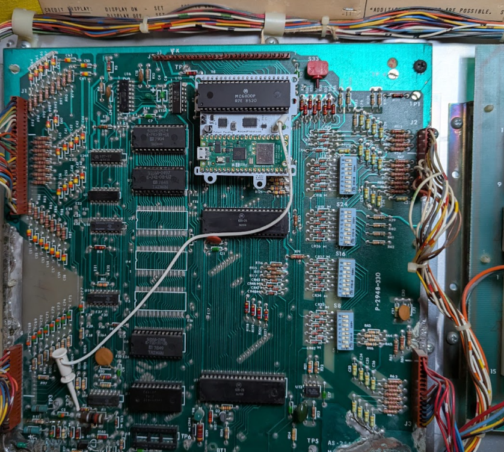
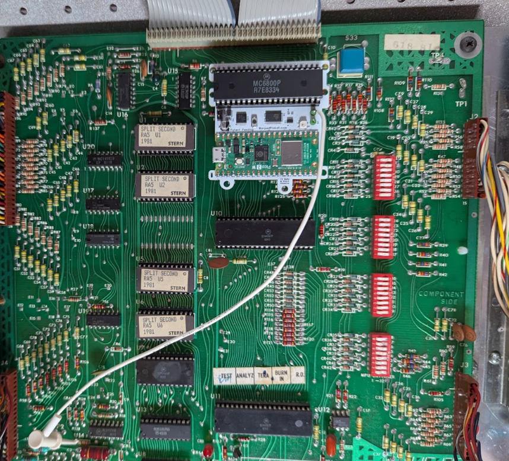
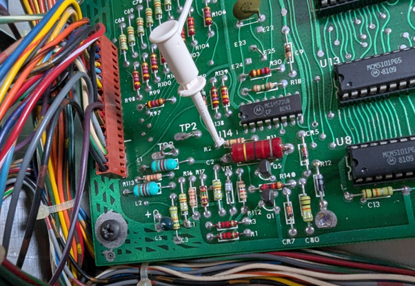
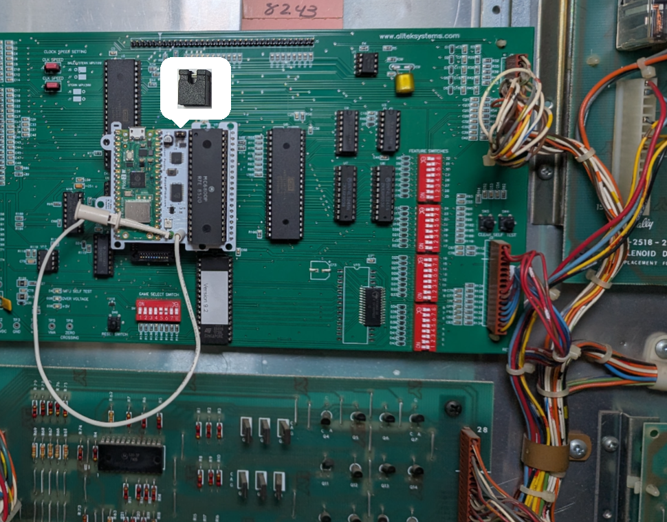
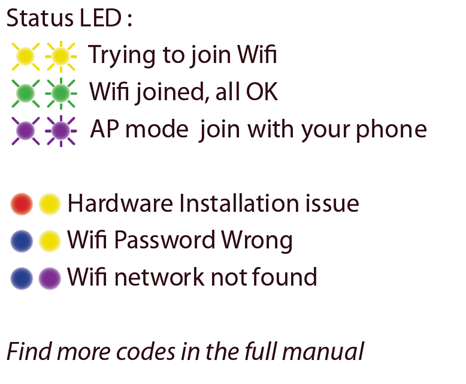

  <h1 style="margin: 0;">Classic Bally / Stern Vector Quick Start (v1.0)</h1>
  <button onclick="window.print()" style="white-space: nowrap;">
    🖨️ Print This Guide
  </button>

Fast-path instructions for installing the Warped Pinball Vector board on a classic
solid-state Bally or Stern machine (Bally AS-2518-17 / AS-2518-35 MPU, Stern
MPU-100 / MPU-200).

## Steps

Check out installation videos at [WarpedPinball.com](https://WarpedPinball.com).

1. Power off the pinball machine.
2. Remove the main processor chip (`MC6800`) from the MPU board. Place it into the
   Vector board's 40-pin socket, matching pin #1 and checking for bent pins.
3. Insert the pin strips into the MPU-board processor socket. Press firmly on each pin
   so it seats fully.

4. Insert the round-pin chip carrier into the socket strips. In some kits this socket
   is pre-installed onto the Vector circuit board, you may skip this step.

5. (Optional) Attach the sticky standoff and screw to the Vector board and peel the backing.
6. Place the board into the MPU-board socket, confirm all pins are seated, and make
   sure the processor orientation matches the original.
  
Installed on a Bally MPU board: 

  
Installed on a Stern MPU board: 

  

7. Clip the white wire to the reset point shown below. This same location is present
   on every Bally AS-2518 and Stern MPU-100/200 board.
  
Clip-to location: 

  
**Using an Alltek Systems replacement MPU?** Skip the white wire clip — see
[Alltek Systems replacement MPU board](#alltek-systems-replacement-mpu-board) at the
end of this guide.

8. Power on the game and connect a smartphone to the **Warped Pinball** WiFi network.
   Click **Sign In** if prompted.
9. Review the configuration page that appears.
10. Select your home WiFi SSID and password. Choose your game and software version
    from the dropdown. If not listed, select **Generic** (Bally or
    Stern MPU-100) or **Generic MPU-200** (Stern MPU-200) and contact Warped Pinball.
11. Set a Pinball Admin password to protect the Admin/Service page
12. Click **Save**, wait for direction to power off the game.
13. Power on and wait for the IP address to appear on the display. Enter the IP on any
    device on the same WiFi—for example `192.168.1.189`. Note - not all games show the
    IP address on the front displays. If it is not shown on the display, find it in 
    your router's device list or re-enter WiFi setup and read it
    at the bottom of the configuration page.

Enjoy the game and chase new high scores! Enter player names under **Players** so
everyone gets an individual best-score board.

## Alltek Systems replacement MPU board

If your game has an **Alltek Systems "Ultimate MPU"** board in place of the original
Bally or Stern MPU, change **step 7**:

- Do **not** use the white wire clip. You may clip the white wire on the extra board 
test point to keep it out of the way.
- Instead, install the shorting jumper included in your kit onto the header on the Warped
  Pinball Vector board. See the picture here for correct board placement.

Everything else in the install is the same.

## Supported games

Vector installs the same way on every classic Bally and Stern single-MPU board. These
board revisions are electrically compatible with each other; the lists below only
help you identify your game and pick the right profile in setup.

### Bally — MPU AS-2518-17

Black Jack · Bobby Orr Power Play · Eight Ball · Evel Knievel · Freedom · Mata Hari ·
Night Rider · Strikes and Spares

### Bally — MPU AS-2518-35

Black Pyramid · BMX · Centaur · Centaur II · Dolly Parton ·
Eight Ball Deluxe · Eight Ball Deluxe Limited Edition · Elektra · Embryon · Fathom ·
Fireball II · Flash Gordon · Frontier · Future Spa ·
Grand Slam · Harlem Globetrotters · Hotdoggin' ·
Kings of Steel · KISS · Lost World · Medusa · Mr. &amp; Mrs. Pac-Man · Mystic ·
Nitro Ground Shaker · Paragon · Playboy · Rolling Stones ·
Silverball Mania · The Six Million Dollar Man · Skateball · Space Invaders · Speakeasy
· Spectrum · Spy Hunter · Star Trek · Supersonic · Vector · Viking ·
Voltan Escapes Cosmic Doom · X's &amp; O's · Xenon

### Stern — MPU-100

Cosmic Princess · Dracula · Hot Hand · Lectronamo · Magic · Memory Lane · Nugent ·
Pinball · Stars · Stingray · Trident · Wild Fyre

### Stern — MPU-200

Ali · Big Game · Catacomb · Cheetah · Flight 2000 ·
Freefall · Galaxy · Iron Maiden · Lightning · Meteor · Nine Ball
· Orbitor 1 · Quicksilver · Seawitch · Split Second · Star Gazer · Viper

If your exact title and ROM revision are not in the setup dropdown, pick the matching
generic profile — **Generic Bally/Stern MPU** for any Bally or Stern MPU-100 game, or
**Generic MPU-200** for a Stern MPU-200 game — and email
[roms@WarpedPinball.com](mailto:roms@WarpedPinball.com) so we can add it.

## Status LED

The Status LED reports install and connection state. Green means all is well; other
common color combinations are shown here — see the full manual for the code table.

## RAM corruption: missing display digits or bad high scores

RAM data can become scrambled during installation— you may see missing or garbled 
display digits, a nonsense high score, or credits that will not clear.

If that happens, open the Vector web page, go to the **Admin** panel, and click
**Reset Pinball Machine**. This reinitializes the game's RAM to a clean state and
restarts the machine. Run a game afterward to confirm the displays and high score
look correct.

This Warped Pinball product is patent pending.
