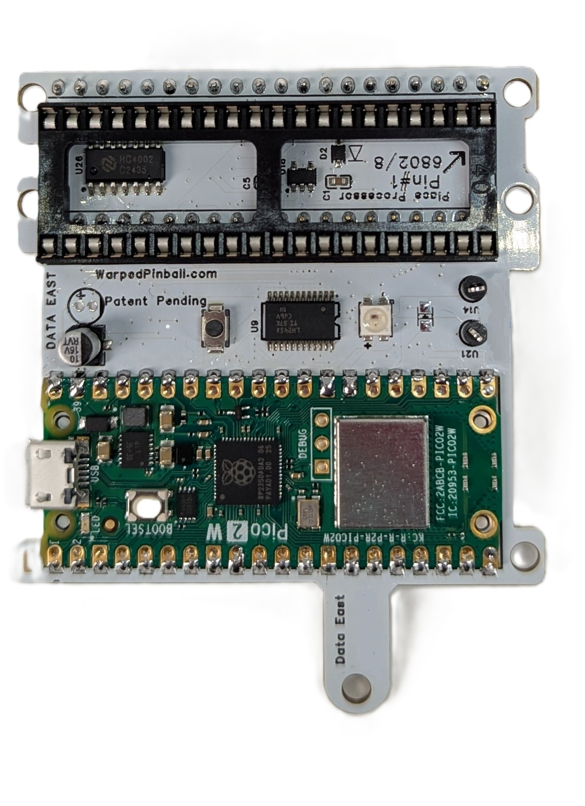
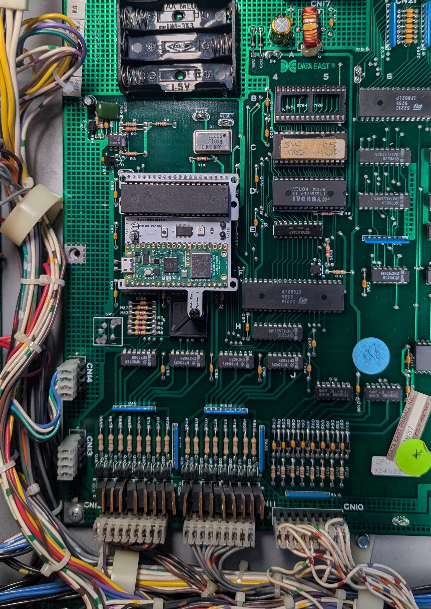
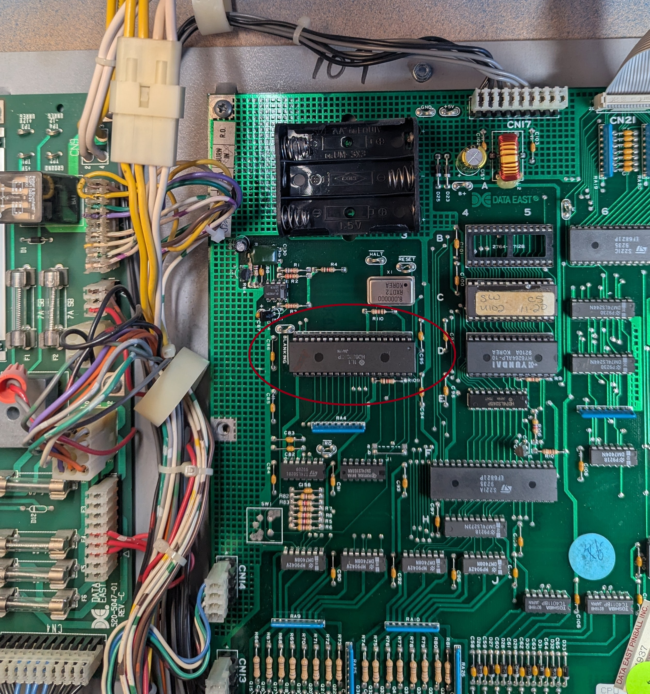
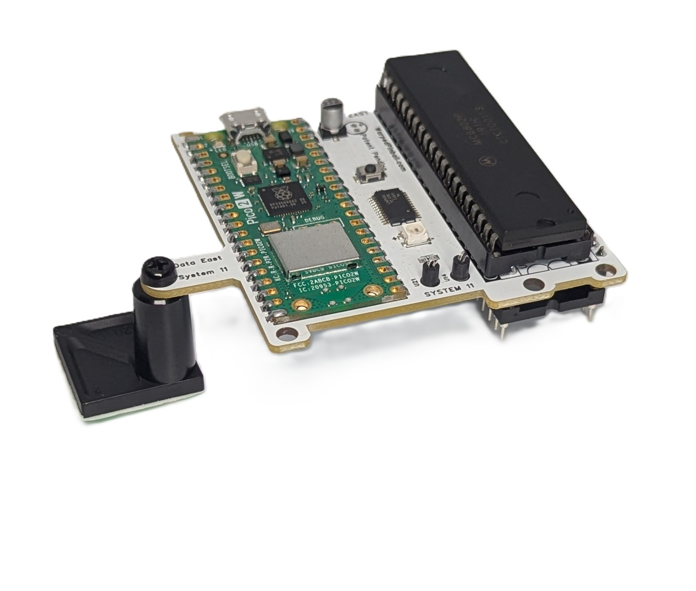

  <h1 style="margin: 0;">Data East Vector Installation and Use Manual</h1>
  <button onclick="window.print()" style="white-space: nowrap;">
    🖨️ Print This Guide
  </button>

How the Vector board installs, what the LEDs mean, and how to bring a classic Data East machine online.

## Table of contents

- [How it works](#how-it-works)
- [LED codes](#led-codes)
- [Indicators and controls](#indicators-and-controls)
- [Disclaimer](#disclaimer)
- [Supported games](#supported-games)
- [Hardware installation](#hardware-installation)
- [Connecting to local WiFi](#connecting-to-local-wifi)
- [IP addresses](#ip-addresses)
- [Operation](#operation)

## How it works

Vector sits between the processor chip and the game's main board so it can act like the RAM chip where settings are stored. Gameplay continues unchanged. The same ROM runs on the same processor. Vector stores RAM values in on-board permanent memory. Installation requires no permanent modification or soldering.

<!-- Two-column layout using a Markdown table -->

|  | Status LED: Yellow-Yellow  Trying to join Wifi Green-Green   Wifi joined, all OK Purple-Purple  AP mode  join with your phone  Red-Yellow  Hardware Installation issue Blue-Yellow  Wifi Password Wrong Blue-Purple  Wifi network not found |
| --- | --- |

## LED codes

The Status LED uses color combinations to indicate system status and faults. Each fault code consists of two color blinks separated by a brief pause.

### Normal Operation
| LED Pattern | Status |
| --- | --- |
| Yellow-Yellow (dim) | Trying to join WiFi at startup |
| Green-Green (dim) | WiFi connected, all systems OK |
| Purple-Purple (dim) | AP mode - join with your phone |

### Hardware Faults (First blink: RED)
| LED Pattern | Code | Description |
| --- | --- | --- |
| Red-Yellow | HDWR01 | Early Bus Activity |
| Red-White | HDWR02 | No Bus Activity |
| Red-Purple | HDWR00 | Unknown Hardware Error |

### WiFi Faults (First blink: BLUE)
| LED Pattern | Code | Description |
| --- | --- | --- |
| Blue-Yellow | WIFI01 | Invalid WiFi Credentials (wrong password) |
| Blue-Purple | WIFI02 | No WiFi Signal (network not found) |
| Blue-Red | WIFI00 | Unknown WiFi Error |

### Configuration Faults (First blink: WHITE)
| LED Pattern | Code | Description |
| --- | --- | --- |
| White-Yellow | CONF01 | Invalid Configuration |
| White-Purple | CONF00 | Unknown Configuration Error |

### Software Faults (First blink: YELLOW)
| LED Pattern | Code | Description |
| --- | --- | --- |
| Yellow-Red | SFTW01 | Drop Through |
| Yellow-White | SFTW02 | Async loop interrupted |
| Yellow-Purple | SFWR00 | Unknown Software Error |

### Other
| LED Pattern | Code | Description |
| --- | --- | --- |
| White | DUNO00 | Unknown Error |

**Note:** Multiple faults will be displayed in sequence with a pause (black) between each fault code.

## Disclaimer

Removing classic game chips carries risk. Work with the game powered off but still grounded, discharge static before touching electronics, and double-check that sockets and ICs are fully seated. Incorrect fuse sizes or partially seated components can damage the machine. Warped Pinball provides email support but cannot be liable for damage.

## Supported games

| Installation picture | System | Titles |
| --- | --- | --- |
|  | Data East | Back to the Future Batman Checkpoint Guns N' Roses Hook Jurassic Park Last Action Hero Lethal Weapon 3 Monday Night Football Phantom of the Opera RAD Mobile Robocop Rocky and Bullwinkle Secret Service Simpsons Pinball Party Star Trek 25th Anniversary Star Wars Tales from the Crypt TMNT The Who's Tommy Pinball Wizard |

## Hardware installation

1. Carefully remove the processor (`MC6802`) and place it into the socket on the Vector board according to pin #1 designation. Verify pins are straight and fully seated. The chip location is identified in this picture:   

Throughout the installation pay attention to pin #1 alignment:

2. To improve mounting and connection reliability, insert the pin-strip headers into each side of the main-board processor socket. Press gently, you will fully seat these later. 

3. Place the 40 pin socket into the pin strip headers. Press firmly all the way around. Make sure all pins are fully seated now.

{ width=180 }

4. Attach the adhesive standoff to the Vector board with the included plastic screw so it can adhere to th eboard surface when installed.  

5. Insert the Vector board into the socket on the main board. Align all pins, press, and confirm each corner is seated. Pay attention to pin #1 alignment throughout this installation.

After connection the game operates normally while the Vector board provides NVRAM service. Configure WiFi to access advanced scoring, tournament, and other features.

## Connecting to local WiFi

1. Power up the pinball machine; the WiFi status LED will start Yellow then flash Purple.
2. On a phone or computer, open WiFi settings and join the **Warped Pinball** network. A no-internet warning is expected.

{ width=220 style="display:block; margin: 0 auto;" }

3. When prompted, tap **Sign In** or open a browser to reach the configuration screen.

{ width=220 style="display:block; margin: 0 auto;" }

4. On the configuration screen:
   - Select your local WiFi **SSID** and enter the password (case sensitive).
   - Choose your **game** from the dropdown (use `GenericDataEast` if not listed; incorrect selection can cause erratic behavior).
   - Optionally set an **Admin Password** to protect actions like erasing scores and leaderboards.
   - If Vector previously joined a network, the assigned IP address is shown at the bottom.

{ width=220 style="display:block; margin: 0 auto;" }

5. Click **Save**. Power-cycle the game to apply settings. On the next boot:
   - Yellow blinking indicates the unit is locating the network.
   - Green blinking LED confirms a successful connection.
   - Slow blinking for several minutes means the join failed—power down, hold the WiFi setup button while powering up, release when the LED blinks purple, and repeat pairing.

**Pro Tip:** To re-enter configuration mode later, hold the WiFi config button during power-up and release when the LED blinks rapidly.

## IP addresses

Each machine receives an IP address from your router (for example `192.168.1.79`). Access Vector by entering the IP in a browser and save it as a bookmark. Router DHCP assignments can change; the Vector board periodically displays the current IP on the machine display. To keep the same address, log into your router, locate the device, and mark the entry as **static**.

Most Data East games display the IP address in attract mode with spaces separating the four numbers (for example: `192 . 168 . 1 . 189`).

## Operation

- Navigation buttons are in the upper-right corner.
- Tournament and personal best scoreboards are accessible via the banner.
- Enter player full names under **Players**.

{ style="display:block; margin: 0 auto;" }

Watch the [features video](https://youtu.be/eGVe5E9X-2I) and send ideas via [WarpedPinball.com](https://WarpedPinball.com).
