

  <h1 style="margin: 0;">Data East Vector Installation and Use Manual</h1>
  <button onclick="window.print()" style="white-space: nowrap;">
    🖨️ Print This Guide
  </button>

How the Vector board installs, what the LEDs mean, and how to bring a classic Data East machine online.

## Table of contents

- [How it works](#how-it-works)
- [LED codes](#led-codes)
- [Disclaimer](#disclaimer)
- [Supported games](#supported-games)
- [Hardware installation](#hardware-installation)
- [Connecting to local WiFi](#connecting-to-local-wifi)
- [IP addresses](#ip-addresses)
- [Web interface](#web-interface)

## How it works

Vector sits between the processor chip and the game's main board so it can act like the RAM chip where settings are stored. Gameplay continues unchanged. The same ROM runs on the same processor. Vector stores RAM values in on-board permanent memory. Installation requires no permanent modification or soldering.

<!-- Two-column layout using a Markdown table -->

| 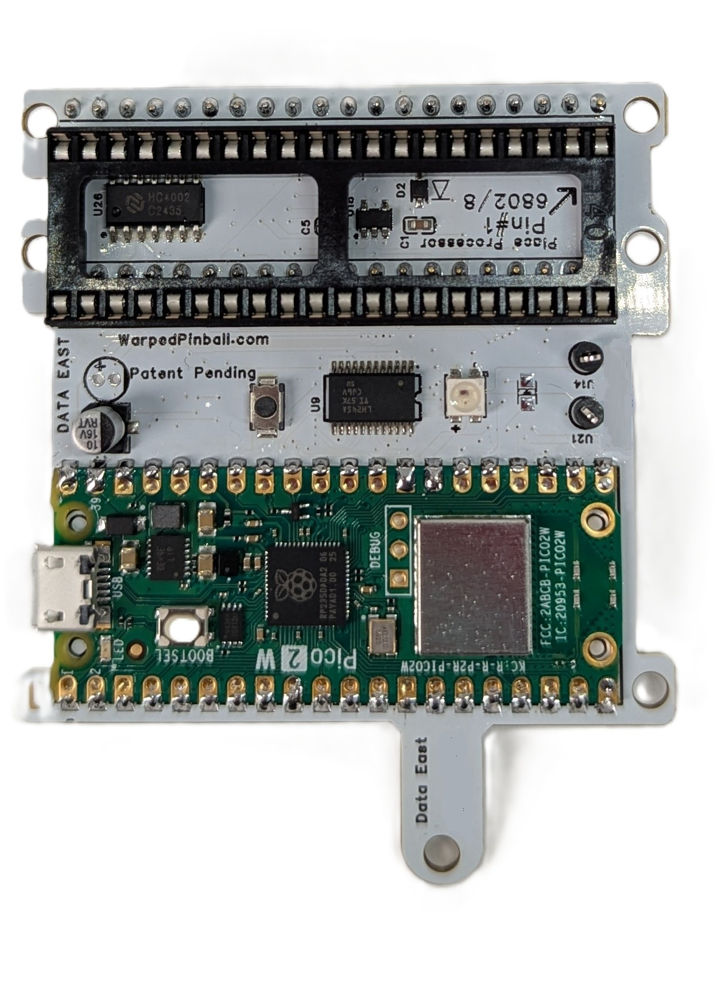 | Status LED: Yellow-Yellow  Trying to join WiFi Green-Green   WiFi joined, all OK Purple-Purple  AP mode - join with your phone  Red-Yellow  Hardware installation issue Blue-Yellow  WiFi password incorrect Blue-Purple  WiFi network not found  WiFi Configure Button: Hold during power up and release when LED flashes for AP mode |
| --- | --- |

## LED codes

The Status LED uses color combinations to indicate system status and faults. Each fault code consists of two color blinks separated by a brief pause.

### Normal Operation
| LED Pattern | Status |
| --- | --- |
| Yellow-Yellow (dim) | Trying to join WiFi at startup |
| Green-Green (dim) | WiFi connected, all systems OK |
| Purple-Purple (dim) | AP mode - join with your phone |

### Hardware Faults (First blink: RED)
| LED Pattern | Code | Description |
| --- | --- | --- |
| Red-Yellow | HDWR01 | Early Bus Activity |
| Red-White | HDWR02 | No Bus Activity |
| Red-Purple | HDWR00 | Unknown Hardware Error |

### WiFi Faults (First blink: BLUE)
| LED Pattern | Code | Description |
| --- | --- | --- |
| Blue-Yellow | WIFI01 | Invalid WiFi Credentials (wrong password) |
| Blue-Purple | WIFI02 | No WiFi Signal (network not found) |
| Blue-Red | WIFI00 | Unknown WiFi Error |

### Configuration Faults (First blink: WHITE)
| LED Pattern | Code | Description |
| --- | --- | --- |
| White-Yellow | CONF01 | Invalid Configuration |
| White-Purple | CONF00 | Unknown Configuration Error |

### Software Faults (First blink: YELLOW)
| LED Pattern | Code | Description |
| --- | --- | --- |
| Yellow-Red | SFTW01 | Drop Through |
| Yellow-White | SFTW02 | Async loop interrupted |
| Yellow-Purple | SFWR00 | Unknown Software Error |

### Other
| LED Pattern | Code | Description |
| --- | --- | --- |
| White | DUNO00 | Unknown Error |

**Note:** Multiple faults will be displayed in sequence with a pause (black) between each fault code.

## Disclaimer

Removing classic game chips carries risk. Work with the game powered off but still grounded, discharge static before touching electronics, and double-check that sockets and ICs are fully seated. Incorrect fuse sizes or partially seated components can damage the machine. Warped Pinball provides email support but cannot be liable for damage.

## Supported games

| Installation picture | System | Titles |
| --- | --- | --- |
| 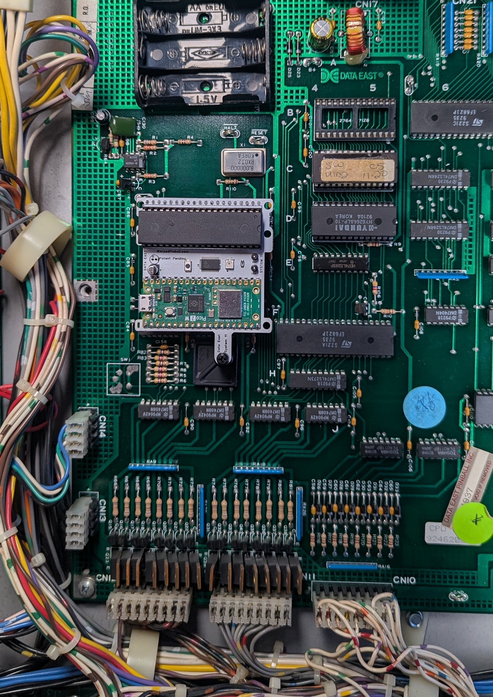 | Data East | Back to the Future Batman Baywatch Checkpoint Frankenstein Guns N' Roses Hook Jurassic Park Last Action Hero Laser War Lethal Weapon 3 Maverick Monday Night Football Phantom of the Opera Playboy RAD Mobile Robocop Rocky and Bullwinkle Secret Service The Simpsons Star Trek 25th Anniversary Star Wars Tales from the Crypt Time Machine TMNT Torpedo Alley The Who's Tommy Pinball Wizard |

## Hardware installation

1. Carefully remove the processor (`MC6802`) and place it into the socket on the Vector board according to pin #1 designation. Verify pins are straight and fully seated. The chip location is identified in this picture:   

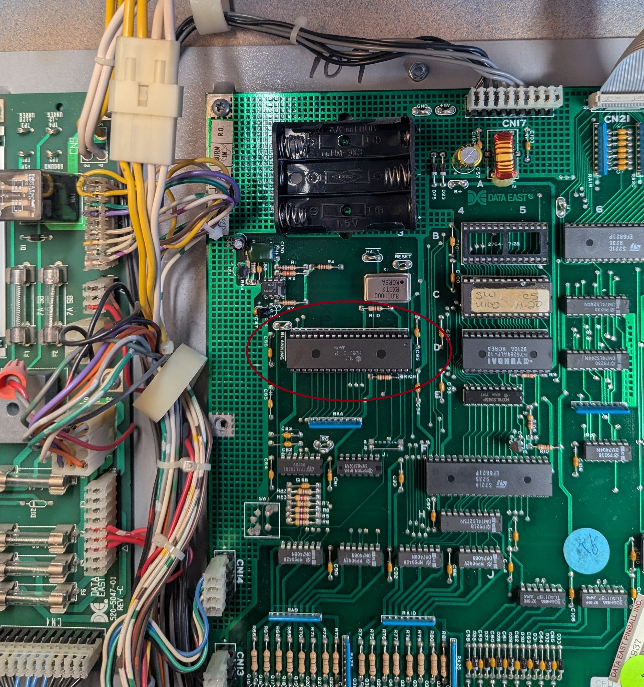

Throughout the installation pay attention to pin #1 alignment:

2. To improve mounting and connection reliability, insert the pin-strip headers into each side of the main-board processor socket. Press gently, you will fully seat these later. 

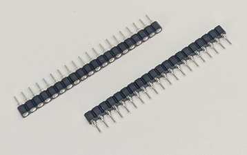

3. Place the 40 pin socket into the pin strip headers. Press firmly all the way around. Make sure all pins are fully seated now.

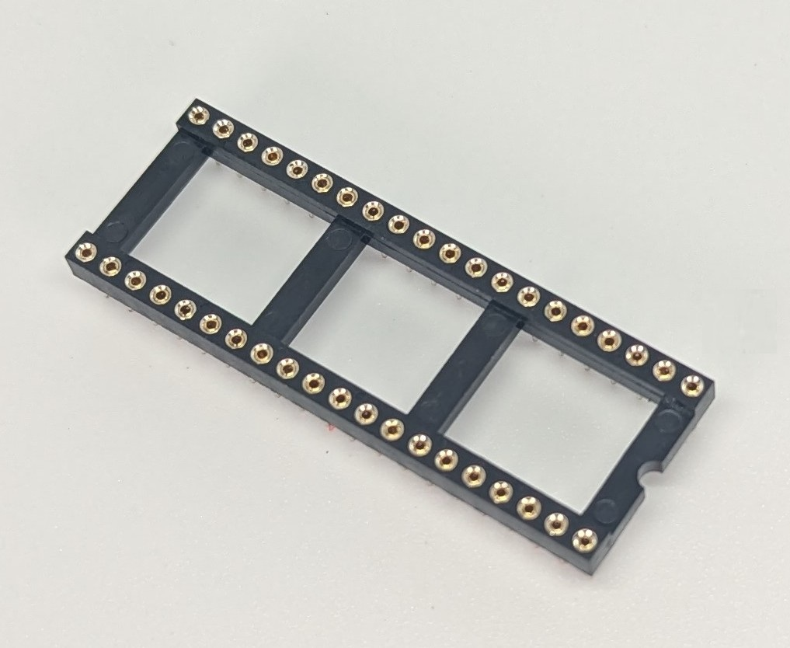

4. Attach the adhesive standoff to the Vector board with the included plastic screw so it can adhere to the board surface when installed.  

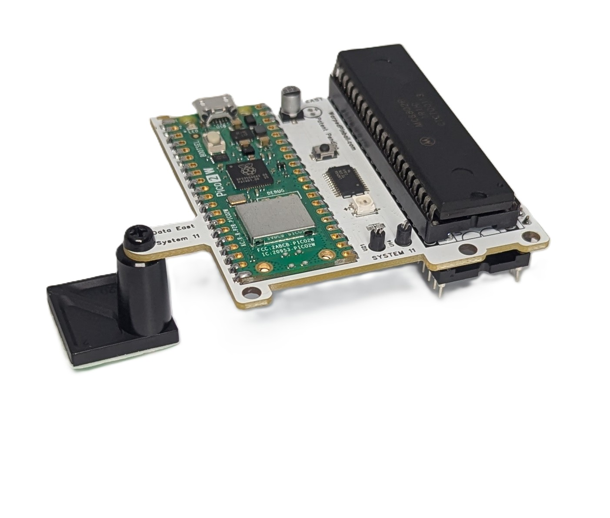

5. Insert the Vector board into the socket on the main board. Align all pins, press, and confirm each corner is seated. Pay attention to pin #1 alignment throughout this installation.

After connection the game operates normally while the Vector board provides NVRAM service. Configure WiFi to access advanced scoring, tournament, and other features.

## Connecting to local WiFi

1. Power up the pinball machine; the WiFi status LED will start Yellow then flash Purple.
2. On a phone or computer, open WiFi settings and join the **Warped Pinball** network. A no-internet warning is expected.

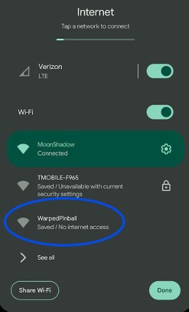

3. When prompted, tap **Sign In** or open a browser to reach the configuration screen.

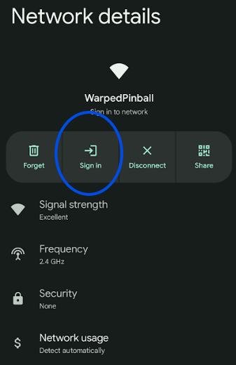

4. On the configuration screen:
   - Select your local WiFi **SSID** and enter the password (case sensitive).
   - Choose your **game** from the dropdown (use `GenericDataEast` if not listed; incorrect selection can cause erratic behavior).
   - Optionally set an **Admin Password** to protect actions like erasing scores and leaderboards.
   - If Vector previously joined a network, the assigned IP address is shown at the bottom.

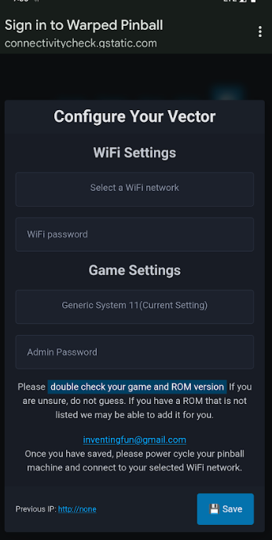

5. Click **Save**. Power-cycle the game to apply settings. On the next boot:
   - Yellow blinking indicates the unit is locating the network.
   - Green blinking LED confirms a successful connection.
   - Check the LED table above for all fault codes.  If Wifi join fails power down, hold the WiFi setup button while powering up, release when the LED blinks purple, and repeat pairing.

**Pro Tip:** To re-enter configuration mode later, hold the WiFi config button during power-up and release when the LED blinks rapidly.

## IP addresses

Each machine receives an IP address from your router (for example `192.168.1.79`). Access Vector by entering the IP in a browser and save it as a bookmark. Router DHCP assignments can change; the Vector board periodically displays the current IP on the machine display. To keep the same address, log into your router, locate the device, and mark the entry as **static**.

Most Data East games display the IP address in attract mode with spaces separating the four numbers (for example: `192 . 168 . 1 . 189`).

## Web interface

- **Game name** is shown in the upper left. If it is not correct, check your AP mode configuration.
- **Navigation** is in the upper right.
- Note the 20 position leaderboard — it will fill up as you play new games.

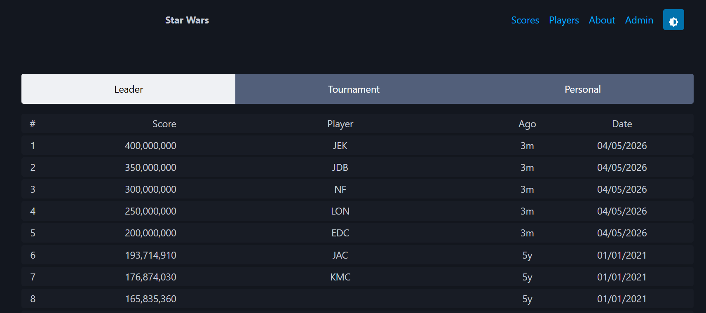

- A game in play is shown on the same screen (see below).
- Note the ball in play and scores update as you play.
- Something not looking correct? Check your ROM version. On game bootup the ROM version is generally displayed on the screen — make sure you pick that ROM version when configuring your Warped Pinball board in AP mode. If you have a ROM that isn't supported, please contact us, we add ROMs regularly.

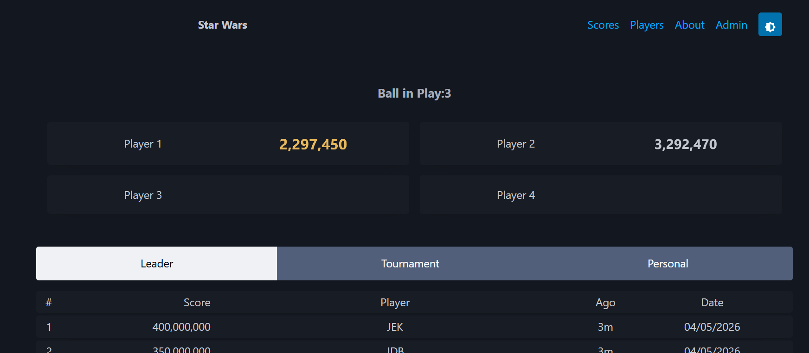

- Click on **Players** to see and edit the active players list.
- All players get individual best boards.
- Initials are entered on the left and full name on the right.

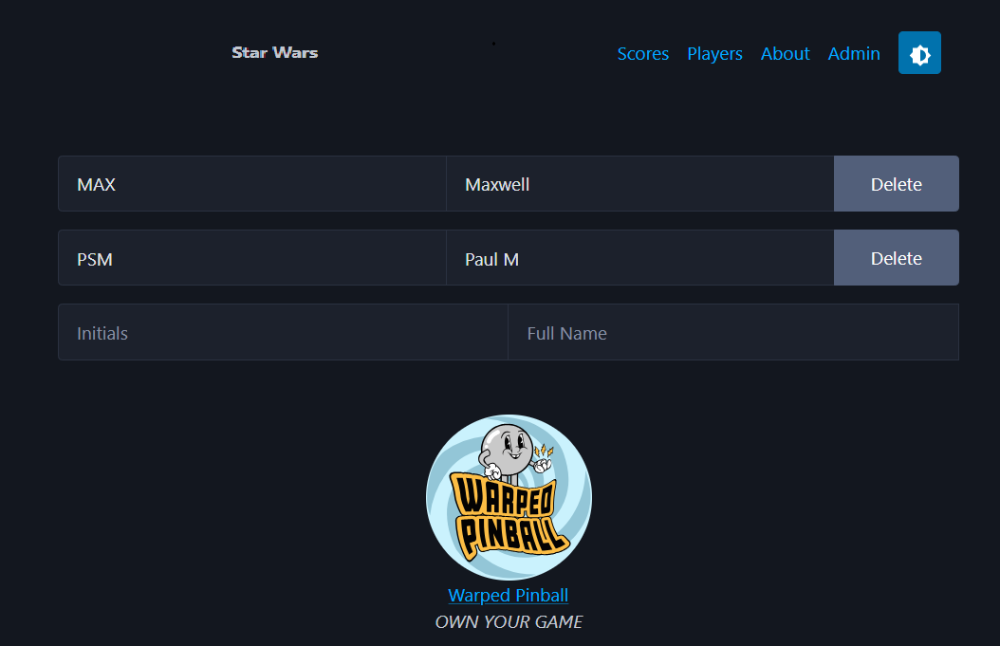

- The top of the admin page shows several setup options.
- **Tournament mode** just saves all scores to the tournament list (and not your normal leaderboard).
- **Score claim: on machine** will cause all players to enter initials to claim their scores after playing (this also records to the individual best boards). Note: not all Data East titles support entering initials on the machine.
- If you don't want to enter initials every play, you can try **Score claim: web interface** — here you claim your score on a web browser after you play.
- Then a section of **adjustment profiles** — use the normal coin door buttons to set up a profile, then enter a name and click capture here to save those settings. You can save and restore up to four.
- Normally the display will show the IP address in attract mode; you can turn this off here.

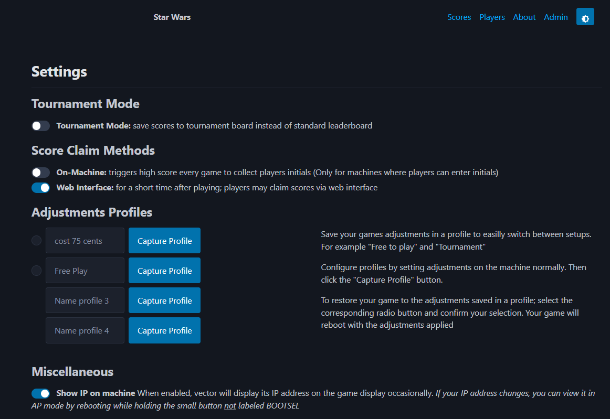

- **Software update process:** just check the update button — it will let you know when there is a software update available.
- The button will also show if the update server was unreachable — if so, just look again later.
- **Upload Developer Build** is used for test versions when directed by Warped Pinball staff.
- The remaining button controls are self-explanatory.

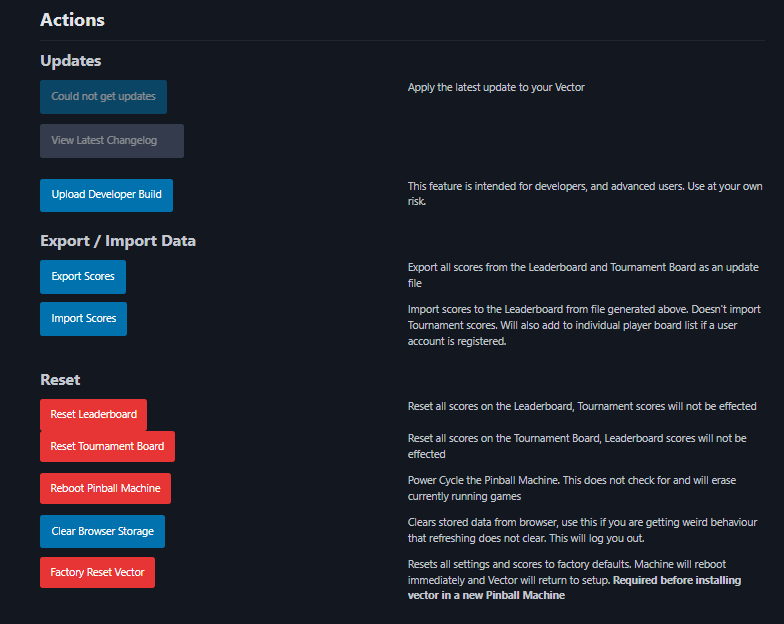

- Use the WiFi status to determine if you have a strong connection.
- **Data East does not currently support switch diagnostics** — the admin page will show "Switch diagnostics are not yet supported for this title" instead of the switch grid seen on other platforms.

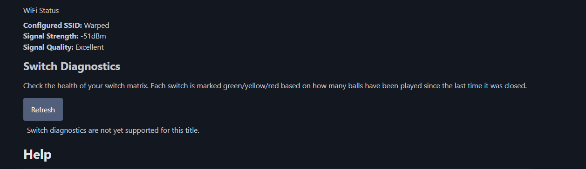

**A note about the software update process:** The update button is the preferred method and takes about 2 minutes to complete. The game will automatically reboot at the end of the process. Check the bottom of any page for the currently installed software version (note that each type of game — WPC, System 11, Data East, EM, etc. — has its own version numbers). In case of trouble (unusual), there is an available program to reload the software via USB cable from a computer. See the [instructions here](https://github.com/warped-pinball/trench-coat/blob/main/Trench-Coat-Install-Guide.md).

Watch the [features video](https://youtu.be/eGVe5E9X-2I) and send ideas via [WarpedPinball.com](https://WarpedPinball.com).
