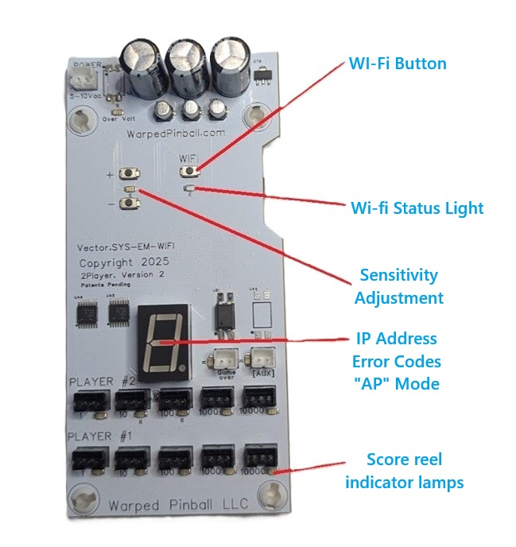
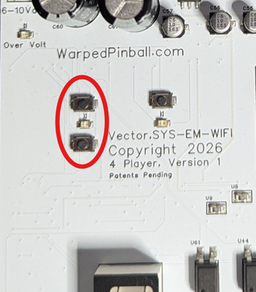
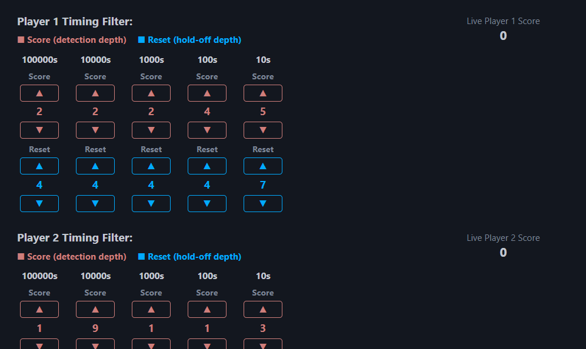

  <h1 style="margin: 0;">System EM Vector Installation and Use Manual</h1>
  <button onclick="window.print()" style="white-space: nowrap;">
    🖨️ Print This Guide
  </button>

How the Vector board installs on an Electro-Mechanical pinball machine, what the buttons and indicators mean, and how to bring your EM online.

## Table of contents

- [How it works](#how-it-works)
- [Indicators and controls](#indicators-and-controls)
- [Disclaimer](#disclaimer)
- [Hardware installation - main board mounting](#hardware-installation-main-board-mounting)
- [Hardware installation - power and Game Over](#hardware-installation-power-and-game-over)
- [Hardware installation - score reel sensors](#hardware-installation-score-reel-sensors)
- [Connecting to local WiFi](#connecting-to-local-wifi)
- [IP addresses](#ip-addresses)
- [Errors](#errors)
- [Configure your game](#configure-your-game)
- [Sensitivity adjustment](#sensitivity-adjustment)
- [Play a few games](#play-a-few-games)
- [Problems? Updates?](#problems-updates)

## How it works

The circuit board is installed in the back box of your Electro-Mechanical pinball machine. You will make alligator clip connections to general illumination power and also to the "Game Over" bulb. A special sensor assembly is attached to each score reel solenoid with a wire tie. There is no soldering required and no permanent modification of the machine.

## Indicators and controls

## Disclaimer

While we make every effort to make this an easy and safe process, damage to your game is possible and we cannot be responsible if something goes wrong. If you have never worked on EM games, we encourage you to find someone who has and offer them some pizza to come help.

Some things to watch for: static electricity can damage circuits. When working with the circuit board, it is not a bad idea to touch the metal frame before you touch electronics - just to make sure that charge you got walking across the carpet is gone.

We offer email support and will do anything we can to help you enjoy Warped Pinball accessories. We cannot, however, be liable for any damage to yourself or machine.

If you find that you need different cables or more hardware please contact us at em@warpedpinball.com

This Warped product counts the actual pulses sent to your score reels. The mechanical action of the reels does not always perfectly reflect the number of pulses - as a result, the Warped score can differ slightly from the score shown on the reels.

## Hardware installation - main board mounting

SYS EM.Wifi main board will be installed on the inside of your back box. It is best to place the board on the inside of the vertical side wall. Every game is a little different; you want to find a spot where game wires will not touch the board and there is not a metal back plate to interfere with WiFi. Before committing to a location, check score reel sensor cable lengths. There is a pack of short sensor leads and some with long sensor leads - make sure you mount the main board in a location where the required sensor leads can reach the score reel coils.

The included mounting screws fit into and through the board plastic standoff spacers as shown. (Two are shown here - you can use all four if you want.)

## Hardware installation - power and Game Over

The board is powered by the general illumination AC voltage in the back box. Find an easy place to measure any bulb that stays on all the time with an AC voltmeter.

Confirm your voltage is between 5.5 and 10 Volts AC as shown:

If the voltage is not within range, it is possible to power the WarpedPinball board with a USB power supply; contact us at Warped for details. With the game turned off, make the power connections with the included alligator clips as shown. An extender cable (included) can then be used to connect power to the main board in the upper left corner. (Red and black are interchangeable.)

Use the second set of alligator clips and extension wire to connect the Game Over lamp in the back box to the main board, right next to the number display. There is no need to measure voltage here. The black and red clips are interchangeable (don't worry about a ground or negative connection) - just get the clips on each side of the Game Over lamp.

## Hardware installation - score reel sensors

Plan a location for the sensor on the coils of each score reel. All sensors must be placed at the same rotation position on all coils. In many older machines, the top of the coil is possible and is the ideal spot. Newer games have a metal bracket in the way - in this case mount all the sensors at about the 11:00 position looking at the back of the coils.

Reels are always numbered 1, 10, 100, 1000, etc. from left to right as you look into the back box. Always use the "1" position on the circuit board - even in the case where you have dummy reels in the game.

Attach each sensor to a wire assembly before installing on the coil. If your coil paper is damaged, you can use the included high-temperature tape dots to repair it before placing sensors. Use the longer wire ties - feeding around the coil and through the loop on the sensor circuit board. Note the "upside down" orientation of the sensor on the coil. This orientation is very important - make sure the sensor faces down towards the coil, and check that it stays in position as you reinstall the score reel. It is important that all the sensors are mounted in the same orientation and angle on each coil.

|  |  |
| --- | --- |

Connect each sensor wire to the main board connectors. The picture below shows the "1" digit for player number one connected. In game setup later you will set how many dummy reels are installed so that your scores scale up correctly.

Once all the sensors are connected, double-check all wiring and wire routing. Keep those wires out of moving parts! There are extra wire ties included to help with this step. Make sure your alligator clips will not short out - tape them up if necessary. Now you are ready to power up the game and get connected to WiFi!

## Connecting to local WiFi

Power up your pinball machine and you will notice the WiFi status LED blinking fast. With a phone or computer open the WiFi configuration and look for a new WiFi network called **WarpedPinball**.

**Pro Tip:** To enter configuration mode in the future, press and hold the WiFi config button and power up the machine. Hold the button until you see the LED blink rapidly. This will put you back in setup mode (WiFi AP mode).

Tap **WarpedPinball** and wait a moment. You may see a warning about no internet service, that is ok. You should get a screen similar to this next example with a **Sign In** button. If your phone or computer does not have this, but has joined the WiFi, try opening a browser for the next step.

In your browser or phone, you should see a configure screen. Pick the SSID (the name of your local WiFi network) and enter your WiFi password for that network - please carefully double-check for capitalization. You can also pick an Admin Password if you like; this password protects functions in the machine like erasing scores and leaderboards.

If the board has previously joined a WiFi network successfully, you will see the IP address it was given at the bottom of this screen.

When ready, just click the Save button. SYS EM.Wifi will remember those WiFi settings and automatically connect to your local WiFi at every power cycle. After pressing Save, you can power the game off and on again for the new setting to take effect.

When the board powers up this time you will see the WiFi status LED blink slowly. Then the number display will begin showing the IP address - this is your indication that the SSID and password are correct.

You can reset settings by powering down, then holding down the WiFi setup button while powering up. When you see the LED blink fast, release the button. You can restart the pairing process.

## IP addresses

Each machine connected to your WiFi will be issued an IP address by your local router. The SYS EM.Wifi device does not have control of the IP address as it is assigned by your local WiFi system. IP addresses are four numbers separated by periods, such as `192.168.1.79`. To access one of your machines, you will need to type the IP address into the address bar on a browser (Chrome, Microsoft Edge, Safari, etc.). Once you connect to a machine, setting a bookmark is a good way to make access simple. After days or weeks of use, your WiFi router may pick a new IP address, requiring you to re-enter it on your computer.

SYS EM.Wifi uses the number display on the main board to show you the IP address. Watch the display as the four numbers are blinked slowly by, with periods between each number.

All routers have a mechanism to set IP addresses as "static", so it is not changed in the future. Once you have connected to your SYS EM.Wifi board we recommend that you log into your local router, find the IP address in the list of connected devices, and check the box making that address static.

## Errors

If the number display shows an error code instead of the IP address, check for the following:

- **E1** - Bad WiFi password. Double-check the password you entered for your local WiFi network and try again.
- **E2** - WiFi network not found. Confirm the SSID you selected is correct and that your WiFi network is in range and broadcasting.
- **AP** - The board has dropped back into AP (setup) mode, and the WiFi status LED will be blinking fast to match. This can happen if the saved WiFi settings no longer work. Reconnect with a phone or computer as described in [Connecting to local WiFi](#connecting-to-local-wifi) - look for the **WarpedPinball** network and sign in again to reconfigure your WiFi settings.

## Configure your game

Open a web browser on any computer on your local WiFi. Type the IP address in the URL bar and you should get the Warped Pinball game screen. Select **Admin** in the upper right corner to get to the page where you configure the game. Input the name, players, reels, and number of dummy (0) reels. Be sure to click **Save Game Config**.

## Sensitivity adjustment

With all the coil sensors installed, and your game powered up and in standby mode (game over mode), click the "Recalibrate" button. The process takes about a minute; during this time the display on the board will show the letter "C".

Now set the sensitivity of the coil sensors for your specific game. Take the glass out so you can hit single targets on the playfield one at a time. Watch the green sensor LEDs on the main board while testing targets (good time to have a helper). The green LED under the correct connector should turn on briefly after the score reel increments. When a carryover occurs, you will see two LEDs blink, one for each reel that is incremented.

Watch carefully and note if the LED sometimes does not blink when the reel increments. If this is the case, just press the "+" button on the main board once and retest. On the other hand, if you see too many LEDs come on when reels are not incrementing, press the "-" button on the main board once and retest. Keep adjusting + or - as required until all score reels register correctly on the green LEDs.

Take time with this step: test each score type (1s, 10s, 100s, etc.) and each player. Make sure you see a single LED blink for each single score increment. You can adjust sensitivity on the web page or with the +/- buttons right on the board, whichever is more convenient.

## Play a few games

There is further adjustment possible in the section below calibration and sensitivity, but changing these values usually isn't necessary. Try a few games, watching what happens on the Admin panel - each player's score is shown so you can compare it with the game score at any time. If you notice a particular digit counting too high, you can increase the red detection depth number for that digit. The detection depth number represents the minimum amount of time the coil must be on to count. You can also try increasing the Blue hold-off depth number, which represents the minimum time between score pulses.

## Problems? Updates?

This is a brand-new system and board for us - we want to hear your feedback to make it better! When there are software updates, the **Update** button on the Admin page will turn yellow. All you need to do is click Update - please do not play the machine during the update process. It only takes a few minutes; you can wait.

The **Clear Browser Storage** button can be useful if the web pages are acting funny or locked up.

Thanks for your support!
