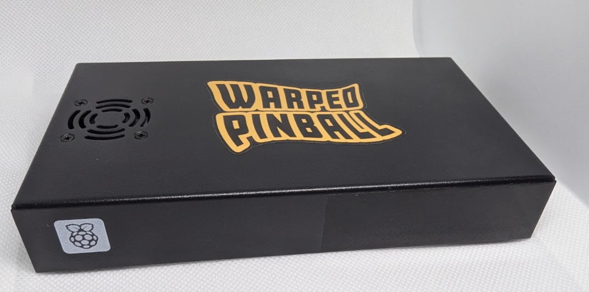
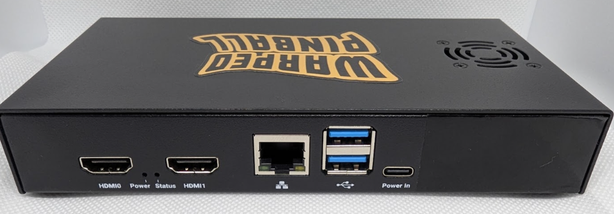
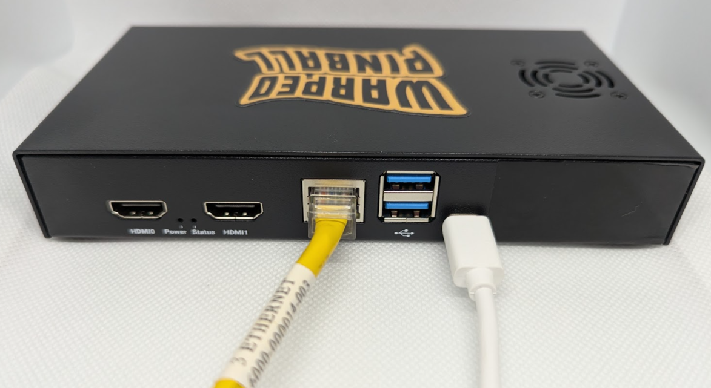
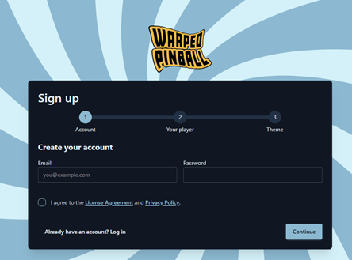
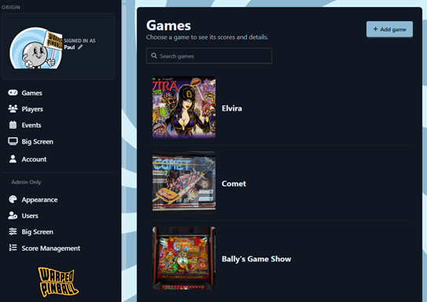

  <h1 style="margin: 0;">Origin Quick Start (v1.0)</h1>
  <button onclick="window.print()" style="white-space: nowrap;">
    🖨️ Print This Guide
  </button>

Origin is a small computer that sits on your local network and pulls together
high scores and live game action from every Vector-enabled pinball machine you
own. Its output looks great on a big-screen TV or any computer monitor. Origin
also runs tournaments, tracks players by name, and runs games in special
competition "modes".

Origin can even log scores from games that do not have a Vector product
installed yet.

A full reference manual — configuration, remote access, backups, and day-to-day
operation — is [coming soon](manual.md).

## What you need

The hardware box supplied by Warped Pinball, its power supply, and an ethernet
cable. That's all.

## Steps

1.  **Get your Vector pinball machines ready.**

    Install the latest software on your Vectors. The minimum required versions
    are:

    | System | Minimum version |
    | --- | --- |
    | System 11 | 1.10.7 |
    | WPC | 1.7.15 |
    | Data East | 1.0.15 |
    | Classic Bally/Stern | 0.1.1 |
    | EM | 1.6.5 |

    Also make sure every game has a password set — blank passwords will not work
    with Origin. The games can all share the same password if you like, but each
    one needs a password. Put a game into AP mode and connect to it with your
    phone to set the password.

2.  **Connect Origin to your network.**

    Plug the ethernet port on Origin into an open router or switch port on your
    local network. This should be the same network your games use. The Origin box
    does not need to be anywhere near the games.

    

3.  **Power up.**

    Use the supplied power supply to power the Origin box. Most USB-C phone
    chargers do not supply enough power for Origin. Use the one we sent with
    Origin.

    

4.  **Check the label and open the web page.**

    Look at the label on the back of your unit (a spare is also included in your
    package). On any computer, go to the web address shown there — for example
    `Origin3.warpedpinball.com`.

    

    Open this page shortly after powering up and sign in — the first login
    automatically becomes the Administrator.

5.  **Create your account.**

    Click **Sign up** and create the first account. The first account on a fresh
    instance automatically becomes the **admin**; everyone who signs up after
    that is a normal player until an admin promotes them.

    

6.  **Connect your machines.**

    Go to **Add machine**. It helps to have an artwork file ready for each game —
    snapping a quick picture of each machine works well.

    

7.  **Put it on the big screen.**

    Open **Big Screen Setup** (`/big-screen/setup`) to pick which games show, how
    many panels appear, and the tournament filters. Then open the big-screen
    leaderboard in a browser or smart TV.

Play a game. Within a few seconds the score should appear live in the web UI and
on the big screen, and the finished game lands on the leaderboard.

## Next steps

For quick access from a computer monitor, use the `Origin3.local:8000` address
shown on your label. Many smart TVs do not accept the `.local` address and need a
full IP instead, such as `192.168.1.123:8000`.

## Frequently asked questions

**Is this just a Raspberry Pi?**

Yes. Origin runs on Raspberry Pi hardware, and we chose it deliberately. The
Raspberry Pi has a long, stable production lifecycle, so the same hardware stays
available and supportable for years. It also has the platform tooling we rely on
to monitor and update Origin remotely, which lets us keep your box healthy and
current with as little effort from you as possible.

**Does this all depend on a server somewhere?**

No. The connection to warpedpinball.com happens over the internet, but all of
your data is processed and stored locally in the Origin box. The local address
(`Origin3.local:8000`) works on your network even when the internet is down.

## Terms of use and consent to remote monitoring

To give you the best experience, Warped Pinball securely monitors and updates
your Origin box over the internet. This lets us deliver software updates and new
features, apply security patches, check that the box is healthy, and help with
support without asking you to run commands yourself.

By connecting Origin to your network and powering it on, you authorize Warped
Pinball to perform this remote monitoring and maintenance for as long as the box
is in service. These connections are encrypted and are used only to operate,
maintain, and support Origin. Warped Pinball does not access other devices on
your network, and access to your box is limited to Warped Pinball personnel for
the purposes described above.

If you prefer not to allow remote monitoring and updates, contact Warped Pinball
support before deploying Origin so we can discuss your options. Disabling this
access may limit our ability to support the product and deliver updates.
