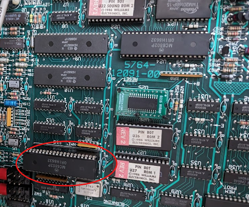
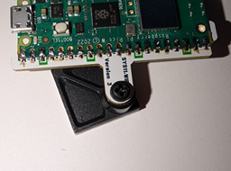
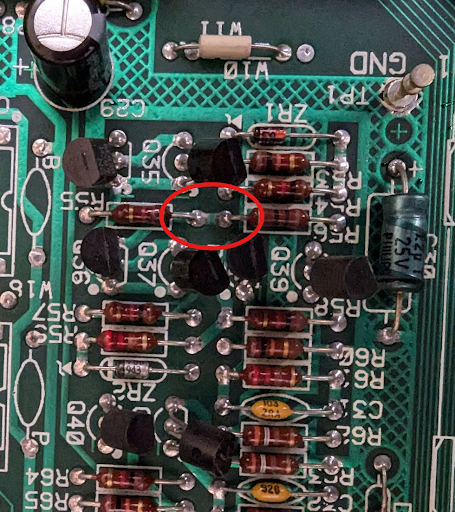
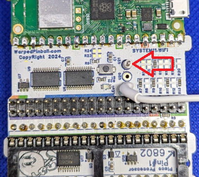

  <h1 style="margin: 0;">System 11 WiFi Module Installation and Use Manual</h1>
  <button onclick="window.print()" style="white-space: nowrap;">
    🖨️ Print This Guide
  </button>

Indicators, installation steps, WiFi setup, and operational notes for SYS11.WiFi.

## Table of contents

- [How it works](#how-it-works)
- [Indicators and controls](#indicators-and-controls)
- [Disclaimer](#disclaimer)
- [Hardware installation](#hardware-installation)
- [Connecting to local WiFi](#connecting-to-local-wifi)
- [IP addresses](#ip-addresses)
- [Operation](#operation)

## How it works

The SYS11.WiFi board installs between the processor chip and the game’s main board, mimicking the RAM chip that stores game settings. Gameplay remains unchanged while the board stores RAM values in permanent memory, eliminating batteries or NVRAM modifications. Installation requires no soldering or permanent changes.

## Indicators and controls

|  | WiFi Status LED  -Fast blink: AP Mode  -Slow Blink: Joining WiFi -Solid ON: WiFi joined  WiFi Configure Button: Hold during power up and release when LED flashes for AP setup mode  Status LED -fast blink: installation fault |
| --- | --- |

## Disclaimer

Removing and reseating chips carries risk. Work with the game powered off but grounded, discharge static on the metal backplane, and verify sockets and ICs are fully seated. Ensure correct fuse sizes. Warped Pinball offers email support but cannot be liable for damage.

## Hardware installation

1. Remove the main processor (`MC6802`) from the game board and insert it into the SYS11.WiFi socket, confirming pins are straight and fully seated.

2. Insert the supplied pin-strip headers into the main-board processor socket, pressing firmly until fully seated. 

3. Place the round-pin chip carrier into the headers, ensuring all pins seat completely.In some kits this socket is pre-installed onto the Vector circuit board, you may skip this step.

4. Attach the adhesive standoff to the SYS11.WiFi board with the provided plastic screw, remove the backing, and align the board with the socket. Inspect all corners to confirm proper seating.

5. Clip the white wire with the micro clip to the junction of `R55` and `R56` (either component on the correct side). This synchronizes resets on power-up.

  
Clip to location at R56 sand R55: 

  
Completed installation: 

  

After installation the game operates normally while SYS11.WiFi provides NVRAM service. Additional features require WiFi configuration.

## Connecting to local WiFi

1. Power on the machine; the WiFi status LED blinks fast (AP mode).
2. Join the **Warped Pinball** network from a phone or computer and ignore “no internet” warnings. 

3. If a captive portal does not appear, open a browser to reach the configuration page.

4. On the configuration page:
   - Select your WiFi SSID and password.
   - Choose your game from the dropdown or select **GenericSystem11** if not listed.
   - Optionally set an admin password to protect actions such as clearing scores.
   - If the board previously joined a network, its last IP address appears on this screen.

5. Click **Save**, power-cycle the machine, and allow it to reconnect. Slow blinking means it is joining; solid indicates a successful connection.
6. If joining fails (slow blink for several minutes), power down, hold the WiFi setup button, power up, release when any LED blinks rapidly, and repeat setup.

**Pro Tip:** To re-enter configuration mode later, hold the WiFi config button during power-up and release when the LED blinks rapidly.

## IP addresses

- The router assigns an IP address to each SYS11.WiFi device (e.g., `192.168.1.239`).
- Access the machine by entering its IP address in a browser on the same network.
- Machines periodically display their IP address on the game display; note changes if the router reassigns addresses.
- For stability, configure a static IP in your router once the device is visible in the connected devices list.

Example: IP address `192.168.1.189` displayed on a Pinbot machine.

## Operation

- Prevent automatic credit awards during initials entry by setting adjustments 18, 19, 20, and 21 to `0` using the coin-door controls.
- SYS11.WiFi stores all data locally; remote access is limited to devices on the same network.
- Most games display the IP address in attract mode with spaces separating the four numbers.

## Sound at Power up?

- Some 11B or C games make a sound at power up.  There is a jumper included in your kit to prevent this sound.

You can add a capacitor to the sound board right on top of (in parallel with) the existing capacitor C15.  A 4.7uF 10 volt or more works well. Or use the included jumper as shown in the pictures below.  Just jumper the test point lop on Vector to the capacitor C15 left side.
  
sound board and connection area circled: 

  
Jumper location on your Vector board: 

  
Jumper location on the soudn board:  

Have feature ideas? Visit [WarpedPinball.com](https://WarpedPinball.com). This Warped Pinball product is patent pending.
