

  <h1 style="margin: 0;">System 11 WiFi Module Installation and Use Manual</h1>
  <button onclick="window.print()" style="white-space: nowrap;">
    🖨️ Print This Guide
  </button>

Indicators, installation steps, WiFi setup, and operational notes for SYS11.WiFi.

## Table of contents

- [How it works](#how-it-works)
- [Indicators and controls](#indicators-and-controls)
- [Disclaimer](#disclaimer)
- [Hardware installation](#hardware-installation)
- [Connecting to local WiFi](#connecting-to-local-wifi)
- [IP addresses](#ip-addresses)
- [Web interface and spotting trouble](#web-interface-and-spotting-trouble)

## How it works

The SYS11.WiFi board installs between the processor chip and the game’s main board, mimicking the RAM chip that stores game settings. Gameplay remains unchanged while the board stores RAM values in permanent memory, eliminating batteries or NVRAM modifications. Installation requires no soldering or permanent changes.

## Indicators and controls

| 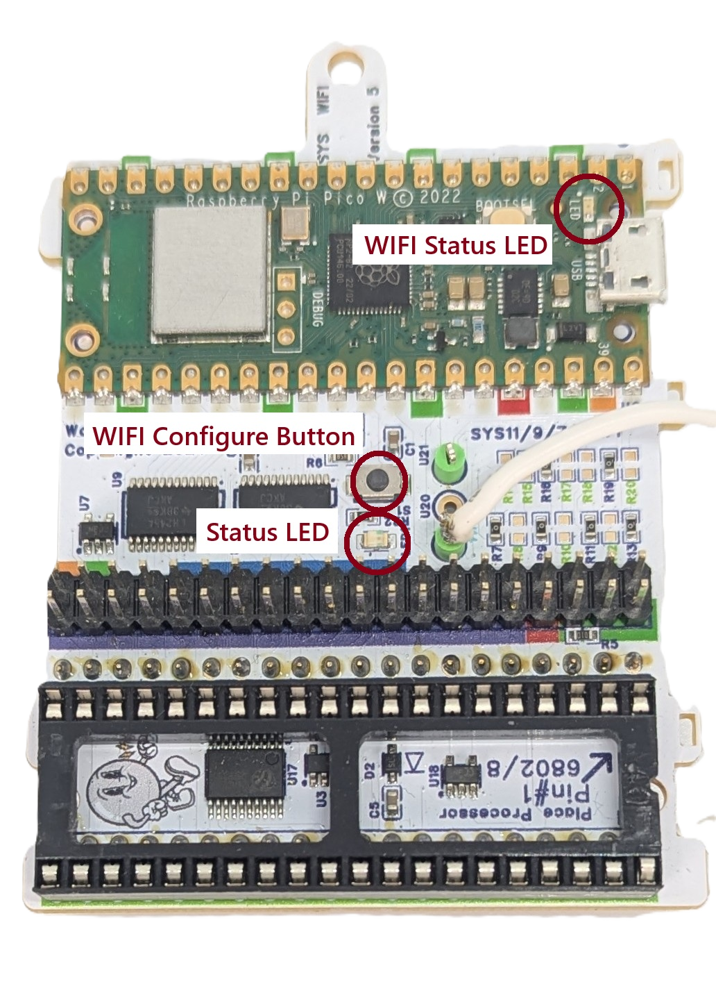 | WiFi Status LED  -Fast blink: AP Mode  -Slow Blink: Joining WiFi -Solid ON: WiFi joined  WiFi Configure Button: Hold during power up and release when LED flashes for AP setup mode  Status LED -fast blink: installation fault |
| --- | --- |

## Disclaimer

Removing and reseating chips carries risk. Work with the game powered off but grounded, discharge static on the metal backplane, and verify sockets and ICs are fully seated. Ensure correct fuse sizes. Warped Pinball offers email support but cannot be liable for damage.

## Hardware installation

1. Remove the main processor (`MC6802`) from the game board and insert it into the SYS11.WiFi socket, confirming pins are straight and fully seated.

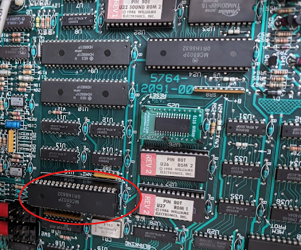

2. Insert the supplied pin-strip headers into the main-board processor socket, pressing firmly until fully seated. 

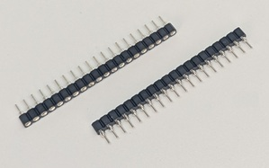

3. Place the round-pin chip carrier into the headers, ensuring all pins seat completely. In some kits this socket is pre-installed onto the Vector circuit board, you may skip this step.

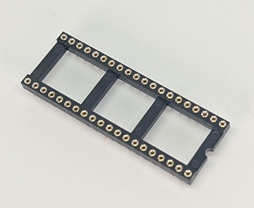

4. Attach the adhesive standoff to the SYS11.WiFi board with the provided plastic screw, remove the backing, and align the board with the socket. Inspect all corners to confirm proper seating.

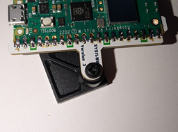

5. Clip the white wire with the micro clip to the junction of `R55` and `R56` (either component on the correct side). This synchronizes resets on power-up.

  
Clip to location at R56 and R55: 
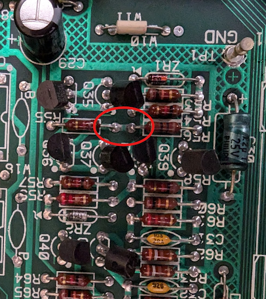
  
Completed installation: 
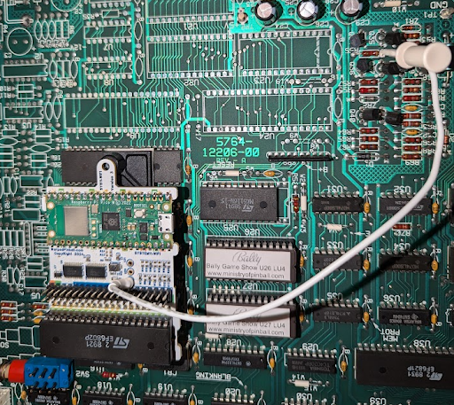
  

After installation the game operates normally while SYS11.WiFi provides NVRAM service. Additional features require WiFi configuration.

## Connecting to local WiFi

1. Power on the machine; the WiFi status LED blinks fast (AP mode).
2. Join the **Warped Pinball** network from a phone or computer and ignore “no internet” warnings. 

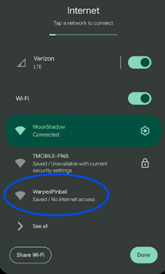

3. If a captive portal does not appear, open a browser to reach the configuration page.

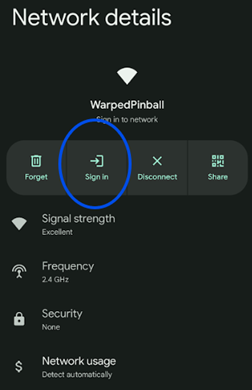

4. On the configuration page:
   - Select your WiFi SSID and password.
   - Choose your game from the dropdown or select **GenericSystem11** if not listed.
   - Optionally set an admin password to protect actions such as clearing scores.
   - If the board previously joined a network, its last IP address appears on this screen.

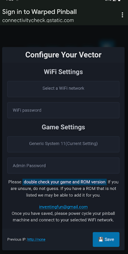

5. Click **Save**, power-cycle the machine, and allow it to reconnect. Slow blinking means it is joining; solid indicates a successful connection.
6. If joining fails (slow blink for several minutes), power down, hold the WiFi setup button, power up, release when any LED blinks rapidly, and repeat setup.

**Pro Tip:** To re-enter configuration mode later, hold the WiFi config button during power-up and release when the LED blinks rapidly.

## IP addresses

- The router assigns an IP address to each SYS11.WiFi device (e.g., `192.168.1.239`).
- Access the machine by entering its IP address in a browser on the same network.
- Machines periodically display their IP address on the game display; note changes if the router reassigns addresses.
- For stability, configure a static IP in your router once the device is visible in the connected devices list.

Example: IP address `192.168.1.189` displayed on a Pinbot machine.

## Web interface and spotting trouble

- **Game name** is shown in the upper left. If it is not correct, check your AP mode configuration.
- **Navigation** is in the upper right.
- Note the 20 position leaderboard — it will fill up as you play new games.

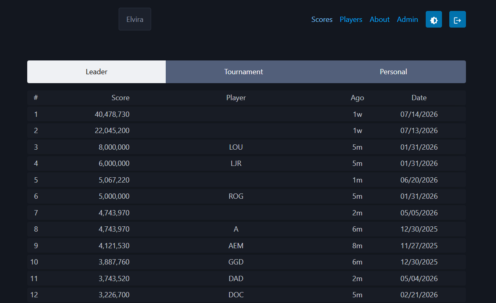

- A game in play is shown on the same screen (see below).
- Note the ball in play and scores update as you play.
- Something not looking correct? Check your ROM version. On game bootup the ROM version is generally displayed on the screen — make sure you pick that ROM version when configuring your Warped Pinball board in AP mode. If you have a ROM that isn't supported, please contact us, we add ROMs regularly.

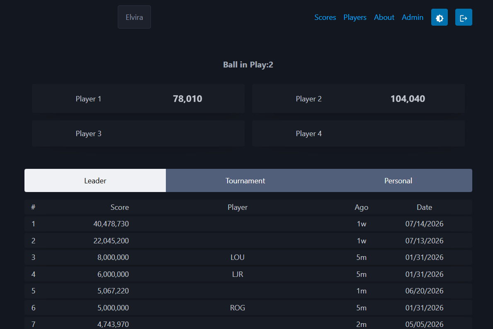

- Click on **Players** to see and edit the active players list.
- All players get individual best boards.
- Initials are entered on the left and full name on the right.

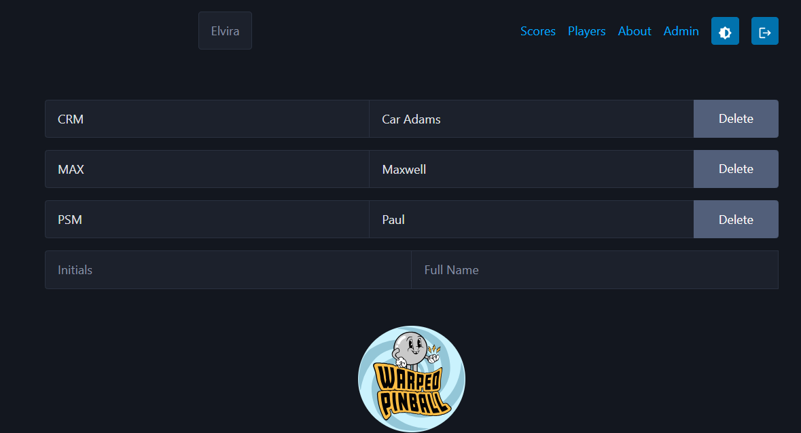

- The top of the admin page shows several setup options.
- **Tournament mode** just saves all scores to the tournament list (and not your normal leaderboard).
- **Score claim: on machine** will cause all players to enter initials to claim their scores after playing (this also records to the individual best boards).
- If you don't want to enter initials every play, you can try **Web interface** — with this feature you claim your score on a web browser after you play.
- Then a section of **adjustment profiles** — use the normal coin door buttons to set up a profile, then enter a name and click capture here to save those settings. You can save and restore up to four.
- Normally the display will show the IP address in attract mode; you can turn this off here.
- Prevent automatic credit awards during initials entry by setting adjustments 18, 19, 20, and 21 to `0` using the coin-door controls.

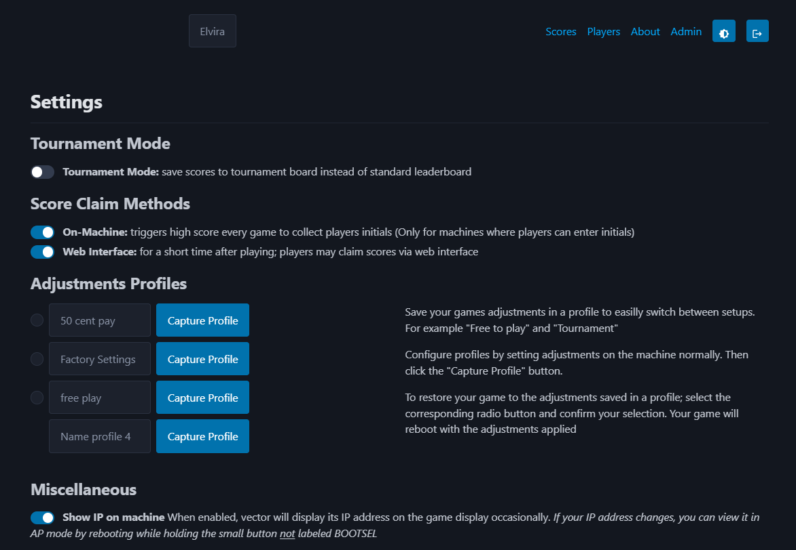

**Example of score claim on front page (note the section at the bottom of the screen)**

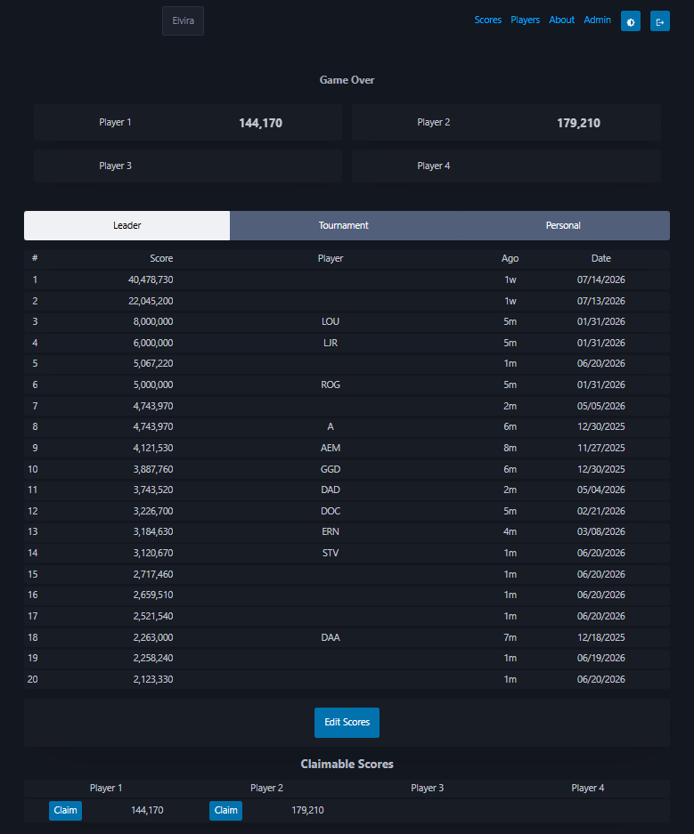

- **Software update process:** just check the Yellow button — it will let you know when there is a software update available.
- The button will also show if the update server was unreachable — if so, just look again later.
- **Upload Developer Build** is used for test versions when directed by Warped Pinball staff.
- The remaining button controls are self-explanatory.

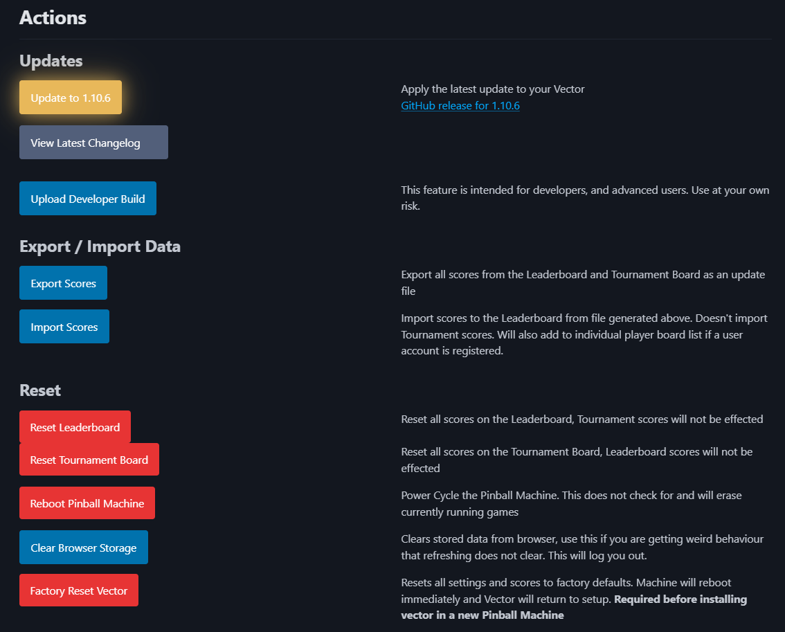

- Use the WiFi status to determine if you have a strong connection.
- Switch diagnostics are shown in the grid of colors at the end of the admin page.

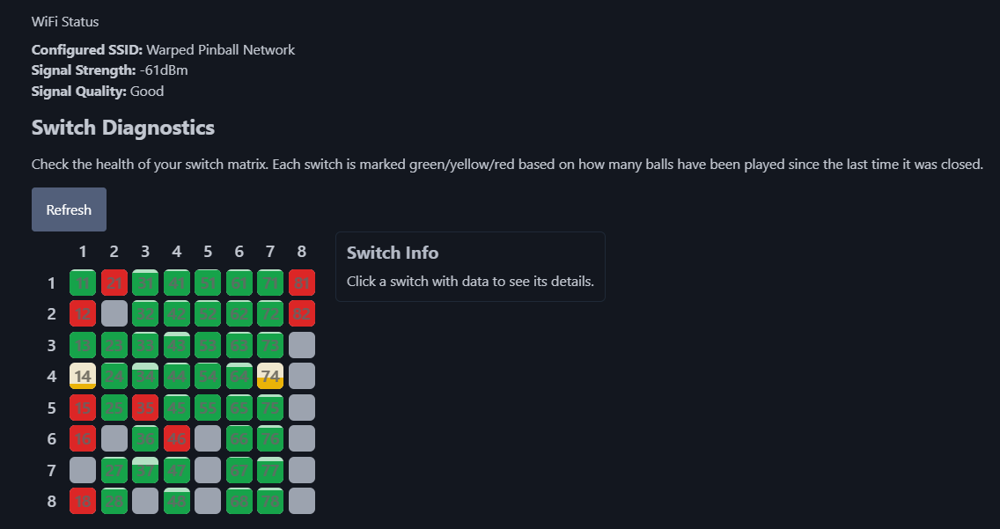

**A note about the software update process:** The Yellow button is the preferred method and takes about 2 minutes to complete. The game will automatically reboot at the end of the process. Check the bottom of any page for the currently installed software version (note that each type of game — WPC, System 11, Data East, EM, etc. — has its own version numbers). In case of trouble (unusual), there is an available program to reload the software via USB cable from a computer. See the [instructions here](https://github.com/warped-pinball/trench-coat/blob/main/Trench-Coat-Install-Guide.md).

Watch the [features video](https://youtu.be/eGVe5E9X-2I) and send ideas via [WarpedPinball.com](https://WarpedPinball.com).

## Sound at Power up?

- Some 11B or C games make a sound at power up.  There is a jumper included in your kit to prevent this sound.

You can add a capacitor to the sound board right on top of (in parallel with) the existing capacitor C15.  A 4.7uF 10 volt or more works well. Or use the included jumper as shown in the pictures below.  Just jumper the test point loop on Vector to the capacitor C15 left side.
  
sound board and connection area circled: 
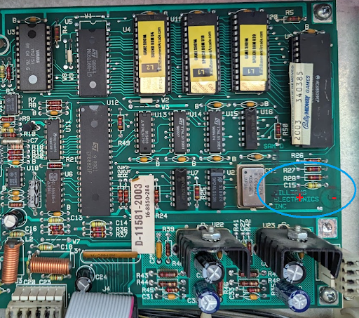
  
Jumper location on your Vector board: 
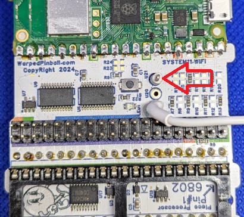
  
Jumper location on the sound board:  
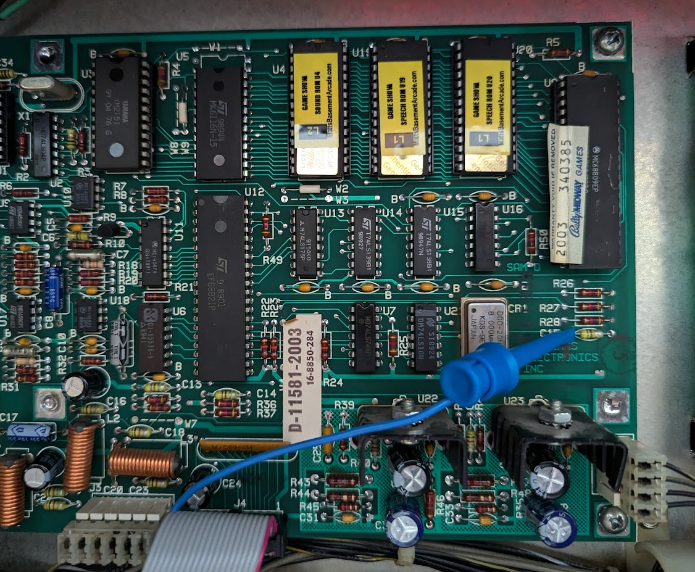

Have feature ideas? Visit [WarpedPinball.com](https://WarpedPinball.com). This Warped Pinball product is patent pending.
