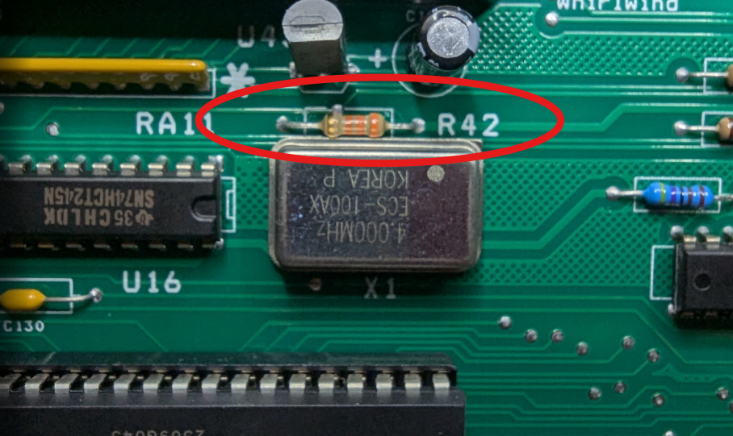
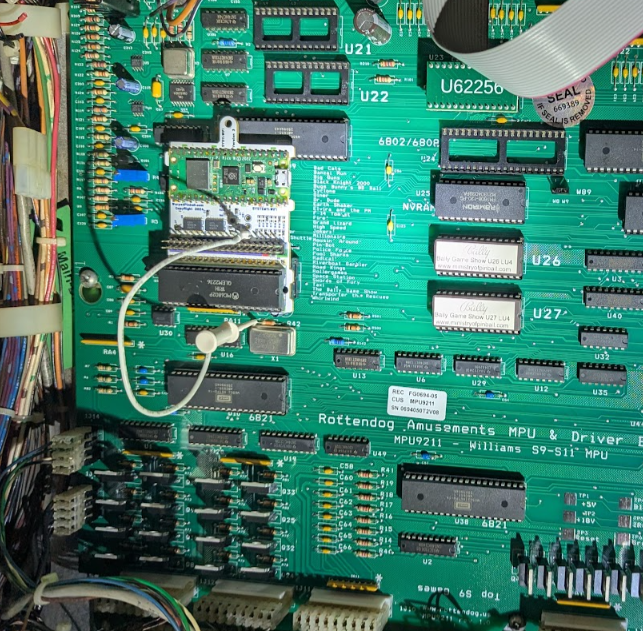
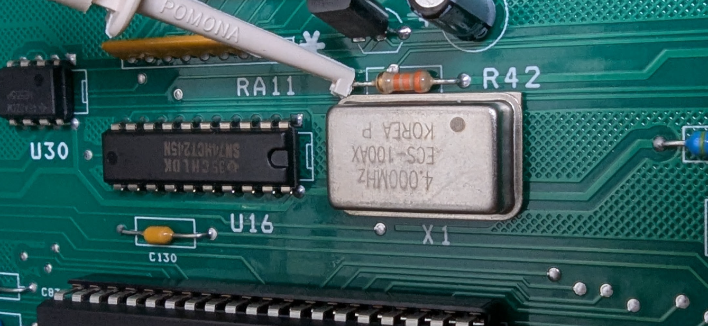

  <h1 style="margin: 0;">System 11 RottenDog Support</h1>
  <button onclick="window.print()" style="white-space: nowrap;">
    🖨️ Print This Guide
  </button>

Notes for installing Vector on games running a RottenDog aftermarket processor board (part number `MPU9211`) instead of the original Williams System 11 CPU board.

## Table of contents

- [Overview](#overview)
- [Disclaimer](#disclaimer)
- [Resistor R42 modification](#resistor-r42-modification)
- [Installing Vector](#installing-vector)

## Overview

Games that have been converted to a RottenDog `MPU9211` processor board run the same System 11 ROMs, but the replacement board is not a perfect electrical match for the original Williams CPU board. Vector still installs the same way — in place of the main processor — but a small modification on the RottenDog board is recommended to get reliable results.

## Disclaimer

Removing and reseating chips carries risk, and modifying a resistor on the RottenDog board is a permanent hardware change. Work with the game powered off but grounded, discharge static on the metal backplane, and verify sockets and ICs are fully seated before powering up. Warped Pinball offers email support but cannot be liable for damage to your RottenDog board or game.

## Resistor R42 modification

RottenDog `MPU9211` boards typically ship with `R42` at **33k ohms**. Warped Pinball recommends changing `R42` to **10k ohms** so the processor comes out of the reset state cleanly with Vector installed.

1. Locate `R42` on the RottenDog board (pictured above).
2. Remove the existing 33k resistor.
3. Install a 10k resistor in its place.

If you have questions about this modification, contact Warped Pinball before making changes.

## Installing Vector

1. Power off the machine.
2. Remove the main processor chip from the RottenDog `MPU9211` board and install it into Vector's 40-pin socket, matching pin #1 and checking for bent pins.
3. Install Vector onto the RottenDog board the same way it installs on an original Williams System 11 CPU board — see the [System 11 manual](manual.md#hardware-installation) for the general procedure and photos.

Close-up of the clip location on the RottenDog board:

