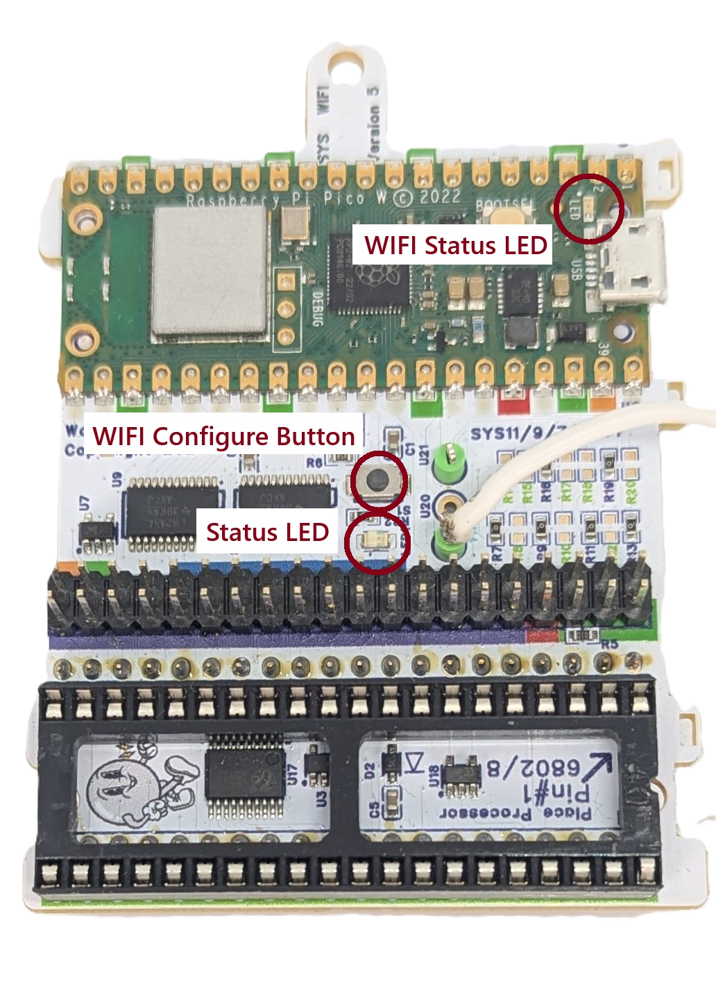
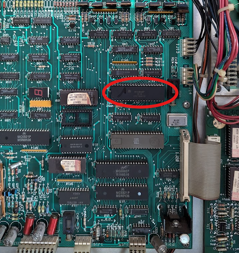
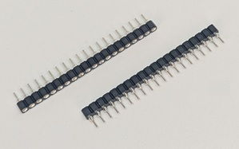
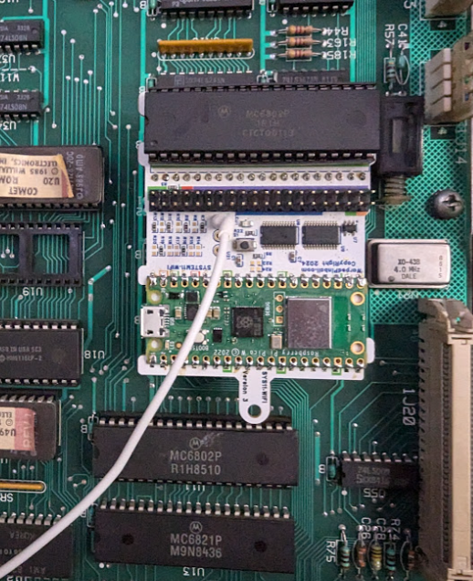
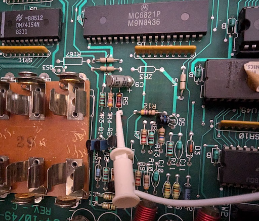
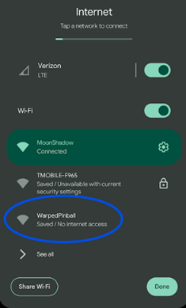
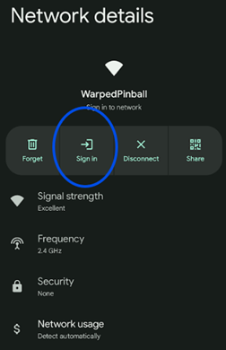

   <h1 style="margin: 0;">System 9 WiFi Module Installation and Use Manual</h1>
   <button onclick="window.print()" style="white-space: nowrap;">
      🖨️ Print This Guide
   </button>

Setup and operation details for SYS9.WiFi.

## Table of contents

- [Supported games](#supported-games)
- [How it works](#how-it-works)
- [Indicators and controls](#indicators-and-controls)
- [Disclaimer](#disclaimer)
- [Hardware installation](#hardware-installation)
- [Connecting to local WiFi](#connecting-to-local-wifi)
- [IP addresses](#ip-addresses)
- [Operation](#operation)
- [Support](#support)

## Supported games

- Comet
- Space Shuttle
- Sorcerer

## How it works

The SYS9.WiFi board installs between the processor chip and the game’s main board to emulate the RAM that stores settings. Gameplay runs on the original software, while the board stores RAM values in permanent memory, eliminating batteries or NVRAM mods. The SYS9 hardware matches the SYS11 board but runs firmware tailored to System 9 titles.

## Indicators and controls

|  | WiFi Status LED  -Fast blink: AP Mode  -Slow Blink: Joining WiFi -Solid ON: WiFi joined  WiFi Configure Button: Hold during power up and release when LED flashes for AP setup mode  Status LED -fast blink: installation fault |
| --- | --- |

## Disclaimer

Pulling chips out of classic games carries inherent risk. If you have never re-seated chips, seek help from someone experienced. Work with the game powered off but plugged in for grounding, discharge static on the metal backplane, double-check every pin for full seating, and confirm fuse ratings.

Warped Pinball offers email support and will assist when possible, but cannot be liable for damage to persons or machines.

## Hardware installation

1. **Remove the main processor**
   - Locate the MC6802 processor on the main board.
   - Carefully remove the chip and inspect pins for alignment.

2. **Insert the processor into SYS9.WiFi**
   - Place the MC6802 into the SYS9.WiFi socket.
   - Ensure pins are straight and press evenly until fully seated.
3. **Install pin strip headers**
   - Insert the provided pin strip headers into the main-board processor socket.
   - Press firmly on sections of 3–4 pins until fully seated.

4. **Add the round pin chip carrier**
   - Place the round pin chip carrier on top of the headers.
   - Press down around the carrier to seat all pins securely.

5. **Mount the SYS9.WiFi board**
   - Attach the standoff using the plastic screw.
   - Align the board with the socket, verify pin alignment, and press firmly until seated.

6. **Connect the reset wire**
   - Attach the white micro clip to the junction of `R5` and `R4` (location varies by board orientation).
   - This synchronizes resets during power-up; expect a few extra seconds at startup.
   - This connection is mandatory for proper operation.

After installation the game operates normally and the board provides NVRAM service. Configure WiFi to enable advanced features.

## Connecting to local WiFi

1. Power on the machine; the WiFi status LED blinks fast (AP mode).
2. Join the **Warped Pinball** network from a phone or computer and ignore “no internet” warnings. 

3. If a captive portal does not appear, open a browser to reach the configuration page.

4. On the configuration page:
   - Select your WiFi SSID and password.
   - Choose your game from the dropdown or select **GenericSystem11** if not listed.
   - Optionally set an admin password to protect actions such as clearing scores.
   - If the board previously joined a network, its last IP address appears on this screen.

5. Click **Save**, power-cycle the machine, and allow it to reconnect. Slow blinking means it is joining; solid indicates a successful connection.
6. If joining fails (slow blink for several minutes), power down, hold the WiFi setup button, power up, release when any LED blinks rapidly, and repeat setup.

**Pro Tip:** To re-enter configuration mode later, hold the WiFi config button during power-up and release when the LED blinks rapidly.

## IP addresses

- Your router assigns an IP address to each machine (e.g., `192.168.1.239`).
- Access the machine by entering its IP in a browser on the same network and bookmark it.
- Routers may change assignments; SYS9.WiFi periodically displays the current IP on the game display.
- Set a static IP in your router once the device is connected for stability.

Example display: IP address `188.168.1.115` shown on a Comet machine.

## Operation

- All data stays local on the board; nothing is pushed to the internet.
- Access the interface only from devices on the same network via the assigned IP.
- System 9 games display the IP address in place of high scores during attract mode.

## Support

Need help or have feature ideas? Visit [WarpedPinball.com](https://WarpedPinball.com).
