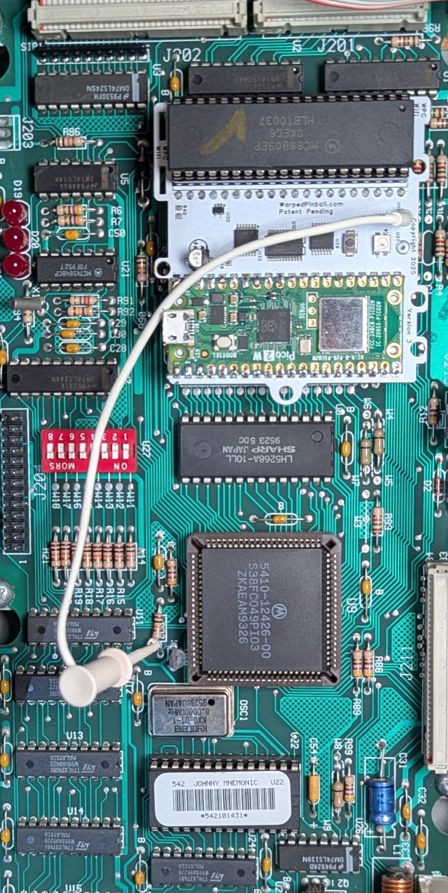
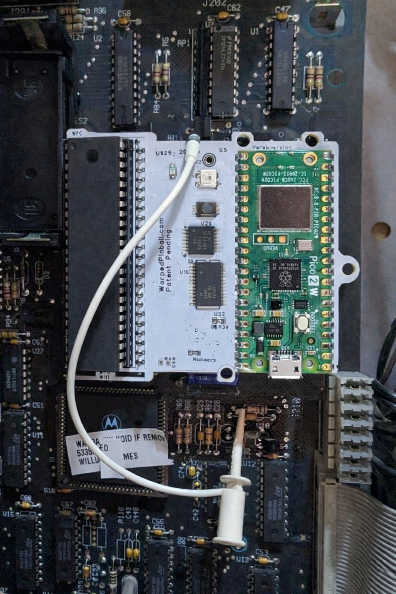
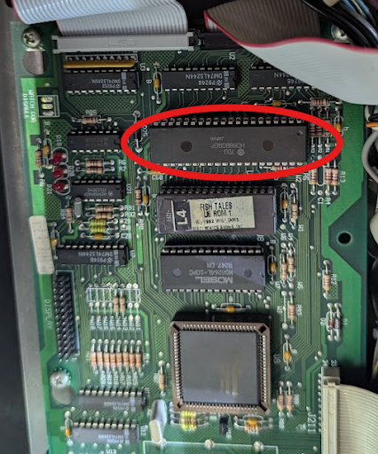
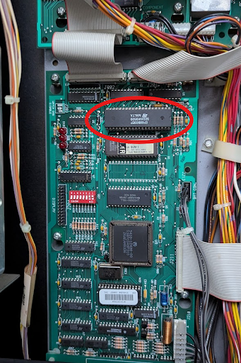
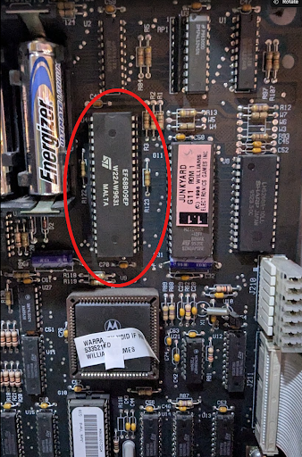
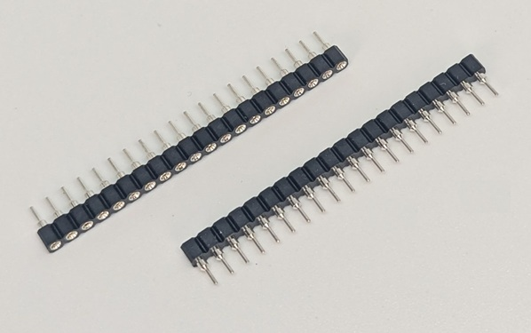
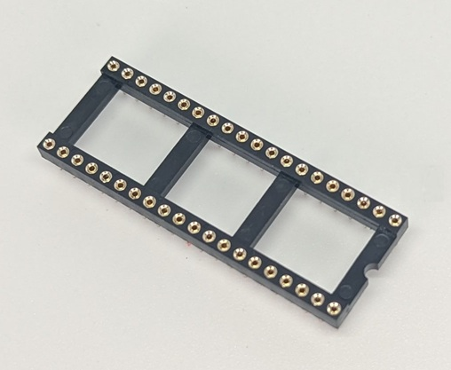
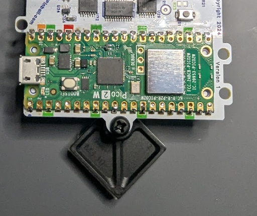
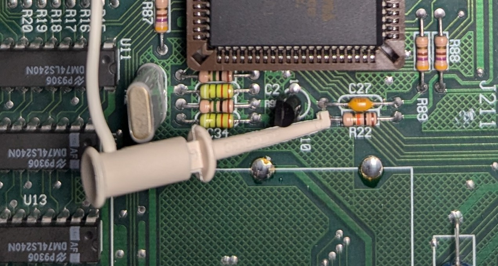

  <h1 style="margin: 0;">WPC Vector Installation and Use Manual</h1>
  <button onclick="window.print()" style="white-space: nowrap;">
    🖨️ Print This Guide
  </button>

How the Vector board installs, what the LEDs mean, and how to bring a classic Williams/Bally WPC machine online.

## Table of contents

- [How it works](#how-it-works)
- [Indicators and controls](#indicators-and-controls)
- [Disclaimer](#disclaimer)
- [Hardware installation](#hardware-installation)
- [Connecting to local WiFi](#connecting-to-local-wifi)
- [IP addresses](#ip-addresses)
- [Operation](#operation)

## How it works

Vector sits between the processor chip and the game’s main board so it can act like the RAM chip where settings are stored. Gameplay continues unchanged. the same ROM runs on the same processor. Vector stores RAM values in on-board permanent memory. Installation requires no permanent modification or soldering.

<!-- Two-column layout using a Markdown table -->

|  | WiFi Status LED  -Fast blink: AP Mode  -Slow Blink: Joining WiFi -Solid ON: WiFi joined  WiFi Configure Button: Hold during power up and release when LED flashes for AP setup mode  Status LED -fast blink: installation fault |
| --- | --- |

## Disclaimer

Removing classic game chips carries risk. Work with the game powered off but still grounded, discharge static before touching electronics, and double-check that sockets and ICs are fully seated. Incorrect fuse sizes or partially seated components can damage the machine. Warped Pinball provides email support but cannot be liable for damage.

## Supported Games

| Installation picture | WPC version | Titles |
| --- | --- | --- |
|  | Williams/Bally WPC | Black Rose Bram Stoker's Dracula Creature from the Black Lagoon Demolition Man Doctor Who Fish Tales Funhouse Gilligan's Island Harley-Davidson Hurricane Indiana Jones Judge Dredd Machine: Bride of Pinbot Party Zone Popeye Saves the Earth Star Trek: TNG Terminator 2 The Addams Family I/II The Getaway: High Speed II Twilight Zone White Water |
|  | Williams/Bally WPC-S | Corvette Dirty Harry Indianapolis 500 JackBot Johnny Mnemonic No Fear: Dangerous Sports Red and Ted's Road Show The Flintstones The Shadow Theatre of Magic WHO Dunnit World Cup Soccer |
|  | Midway/Williams WPC-95 | Attack from Mars Cactus Canyon Cirqus Voltaire Congo Junk Yard Medieval Madness Monster Bash NBA Fastbreak No Good Gofers Safe Cracker Scared Stiff Tales of the Arabian Nights The Champion Pub |
|  | WPC | Rotten Dog aftermarket Board Installation |

## Hardware installation

1. Carefully remove the processor (`MC6809`) and place it into the socket on the Vector board according to pin #1 designation. Verify pins are straight and fully seated. Chip locations are identified in these pictures (depending on your game model)   

Throughout the installation pay attention to pin #1 alignment:

2. To improve mounting and connection reliability, insert the pin-strip headers into each side of the main-board processor socket. Press 3–4 pins at a time until fully seated. 

3. Place the 40 pin socket into the pin strip headers (on some kit this header is already attached to the circuit board, you can skip this step) 

4. (Optional) Attach the adhesive standoff to the Vector board with the included plastic screw so it can adhere to a neighboring chip.  

5. Insert the Vector board into the socket on the main board. Align all pins, press, and confirm each corner is seated. Pay attention to pin #1 alignment throughout this installation.

| WPC Clip Location | WPC-S Clip Location |
| :---: | :---: |
|  WPC |  WPC-S |

| WPC-95 Clip Location | Rotten Dog Clip Location |
| :---: | :---: |
|  WPC-95 |  Rotten Dog |

After connection the game operates normally while the Vector board provides NVRAM service. Configure WiFi to access advanced scoring, tournament, and other features.

## Connecting to local WiFi
1. Power up the pinball machine; the WiFi status LED should blink fast.
2. On a phone or computer, open WiFi settings and join the **Warped Pinball** network. A no-internet warning is expected.

  

3. When prompted, tap **Sign In** or open a browser to reach the configuration screen.

  

4. On the configuration screen:
   - Select your local WiFi **SSID** and enter the password (case sensitive).
   - Choose your **game** from the dropdown (use `GenericWPC` if not listed; incorrect selection can cause erratic behavior).
   - Optionally set an **Admin Password** to protect actions like erasing scores and leaderboards.
   - If Vector previously joined a network, the assigned IP address is shown at the bottom.

  

5. Click **Save**. The WiFi status LED will stop blinking. Power-cycle the game to apply settings. On the next boot:
   - Slow blinking indicates the unit is locating the network.
   - Solid LED confirms a successful connection.
   - Slow blinking for several minutes means the join failed—power down, hold the WiFi setup button while powering up, release when the LED blinks fast, and repeat pairing.

**Pro Tip:** To re-enter configuration mode later, hold the WiFi config button during power-up until the LED blinks rapidly.

## IP addresses

Each machine receives an IP address from your router (for example `192.168.1.79`). Access Vector by entering the IP in a browser and save it as a bookmark. Router DHCP assignments can change; the Vector board periodically displays the current IP on the machine display. To keep the same address, log into your router, locate the device, and mark the entry as **static**.

  

Have a color Pin2DMD?   Use the buttons on the back of the display to set it to **Williams/Bally Mode**.

## Operation

- Navigation buttons are in the upper-right corner.
- Tournament and personal best scoreboards are accessible via the banner.
- Enter player full names under **Players**.

  

Watch the [features video](https://youtu.be/eGVe5E9X-2I) and send ideas via [WarpedPinball.com](https://WarpedPinball.com).
