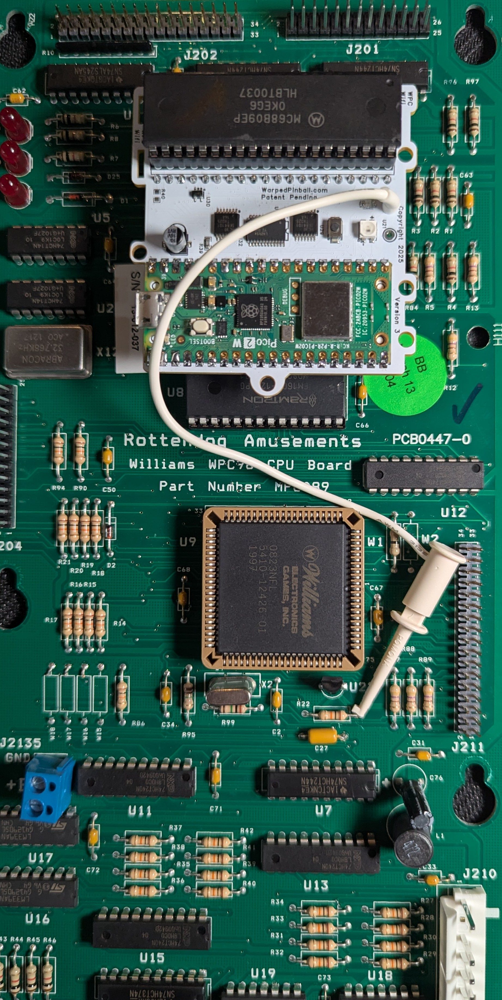

    <h1 style="margin: 0;">System WPC WiFi Module Quick Start Guide</h1>
    <button onclick="window.print()" style="white-space: nowrap;">
        🖨️ Print This Guide
    </button>

[Back to All Guides](../index.md)

## Overview

This quick start helps you install the Warped Pinball WiFi module. If this is your first install, watch the [installation videos](https://youtube.com/playlist?list=PLviUqcd3jBxrLbbLz9X2bv3VnlM3TLe6F&si=zwGBoLwztZszCIlE).

<table>
    <tr>
        <td style="vertical-align: top; padding-right: 16px;">
            
        </td>
        <td style="vertical-align: top;">
            <h3>WiFi Status LED</h3>
            <ul>
                <li><strong>Fast blink</strong>: Access Point (AP) mode</li>
                <li><strong>Slow blink</strong>: Joining WiFi</li>
                <li><strong>Solid on</strong>: WiFi joined and active</li>
            </ul>
            <h3>WiFi Configure Button</h3>
            
Hold during power-up and release when the LED flashes to enter setup mode.

            <h3>Status LED</h3>
            <ul>
                <li><strong>Fast blink</strong>: Installation fault</li>
                <li><strong>Solid on</strong>: Normal operation</li>
            </ul>
        </td>
    </tr>
</table>

### Disclaimer

Removing classic game chips carries risk. Damage is possible and not the responsibility of Warped Pinball. If you are unfamiliar with reseating chips, ask someone experienced to assist.

### Hardware installation

1. Power off the game and locate the main processor (`MC6809`).
2. Carefully remove the processor and place it into the socket on the SYS WPC.WiFi board.
3. Identify your WPC main board style (three variants) and follow the matching photo.
4. Insert the pin strips into the main board socket, add the round-pin chip carrier, and seat the WiFi board.
5. Connect the white wire clip securely.

### Online setup

1. Power the game.
2. Connect a phone to the **WarpedPinball WiFi** network.
3. Complete setup and join your local WiFi.

## Supported titles

| Installation picture | WPC version | Titles |
| --- | --- | --- |
|  | Williams/Bally WPC | Black Rose Bram Stoker's Dracula Creature from the Black Lagoon Demolition Man Doctor Who Fish Tales Funhouse Gilligan's Island Harley-Davidson Hurricane Indiana Jones Judge Dredd Machine: Bride of Pinbot Party Zone Popeye Saves the Earth Star Trek: TNG Terminator 2 The Addams Family I/II The Getaway: High Speed II Twilight Zone White Water |
|  | Williams/Bally WPC-S | Corvette Dirty Harry Indianapolis 500 JackBot Johnny Mnemonic No Fear: Dangerous Sports Red and Ted's Road Show The Flintstones The Shadow Theatre of Magic WHO Dunnit World Cup Soccer |
|  | Williams/Bally WPC-95 | Attack from Mars Cactus Canyon Cirqus Voltaire Congo Junk Yard Medieval Madness Monster Bash NBA Fastbreak No Good Gofers Safe Cracker Scared Stiff Tales of the Arabian Nights The Champion Pub |
|  | RottenDog CPU | Any |

