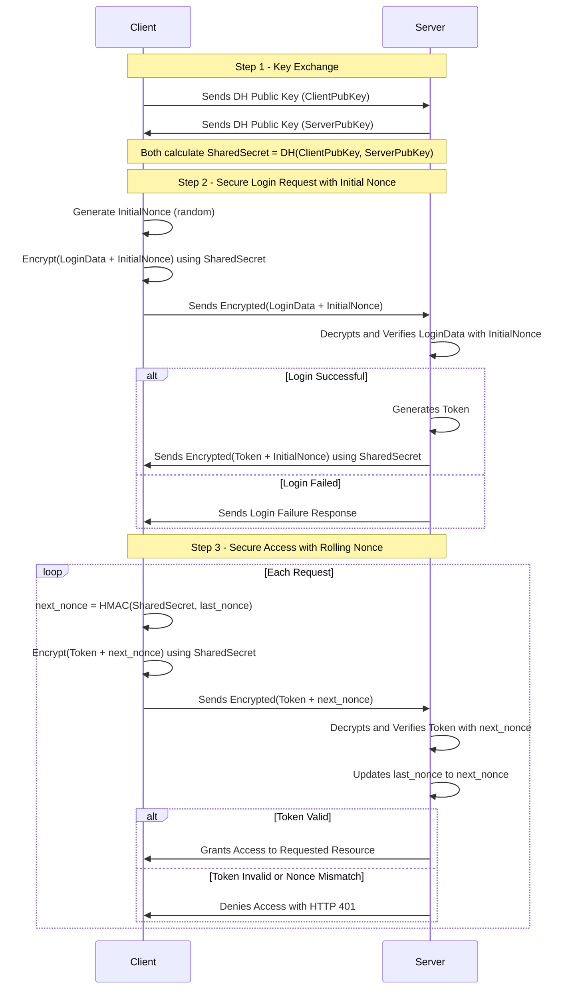

```mermaid
sequenceDiagram
    participant Client
    participant Server

    %% Key Exchange (Diffie-Hellman)
    Note over Client, Server: Step 1 - Key Exchange
    Client->>Server: Sends DH Public Key (ClientPubKey)
    Server->>Client: Sends DH Public Key (ServerPubKey)
    Note over Client, Server: Both calculate SharedSecret = DH(ClientPubKey, ServerPubKey)

    %% User Login Flow with Initial Nonce
    Note over Client, Server: Step 2 - Secure Login Request with Initial Nonce
    Client->>Client: Generate InitialNonce (random)
    Client->>Client: Encrypt(LoginData + InitialNonce) using SharedSecret
    Client->>Server: Sends Encrypted(LoginData + InitialNonce)
    Server->>Server: Decrypts and Verifies LoginData with InitialNonce
    alt Login Successful
        Server->>Server: Generates Token
        Server->>Client: Sends Encrypted(Token + InitialNonce) using SharedSecret
    else Login Failed
        Server->>Client: Sends Login Failure Response
    end

    %% Token-Based Access with Rolling Nonce and Shared Secret
    Note over Client, Server: Step 3 - Secure Access with Rolling Nonce
    loop Each Request
        Client->>Client: next_nonce = HMAC(SharedSecret, last_nonce)
        Client->>Client: Encrypt(Token + next_nonce) using SharedSecret
        Client->>Server: Sends Encrypted(Token + next_nonce)
        Server->>Server: Decrypts and Verifies Token with next_nonce
        Server->>Server: Updates last_nonce to next_nonce
        alt Token Valid
            Server->>Client: Grants Access to Requested Resource
        else Token Invalid or Nonce Mismatch
            Server->>Client: Denies Access with HTTP 401
        end
    end

```